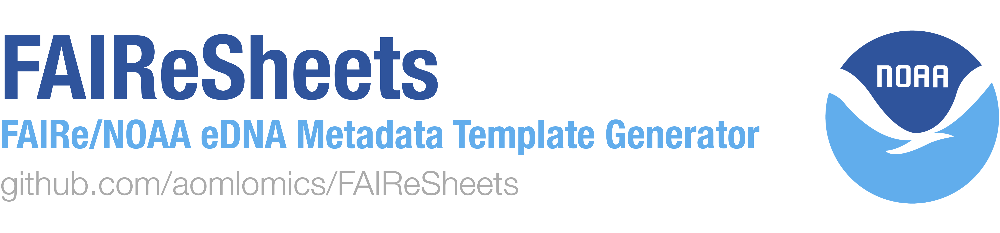

<div align="center">
  
</div>

FAIReSheets converts the FAIR eDNA ([FAIRe](https://fair-edna.github.io/index.html)) data checklist to customizable Google Sheets templates. FAIReSheets can be run in one of 2 modes:
1. **FAIRe eDNA:** Generate FAIRe eDNA data templates from the FAIRe checklist
2. **ODE-ready (NOAA):** Generate ODE-ready (NOAA) data templates, ready for submission to the [Ocean DNA Explorer](https://www.oceandnaexplorer.org/), and can be used as input to [edna2obis](https://github.com/aomlomics/edna2obis), a data pipeline for submission to [GBIF](https://www.gbif.org/) and [OBIS](https://obis.org/).

NOTE: FAIReSheets generates BLANK templates. You must fill them in with data manually after they're generated.

### Quick Start Summary
Email bayden.willms@noaa.gov to be added to the user list and receive the link to the credentials file, create a blank Google Sheet, configure the `.env` file with the Google Sheet ID and the Git Gist URL, specify your parameters in `config.yaml` and optionally in `NOAA_config.yaml` if you want NOAA/ODE-ready templates, follow the authentication workflow (on your browser), and run `python run.py`.

---
### Table of Contents
1. [Prerequisites](#Prerequisites)
2. [Installation](#Installation)
3. [Configuration](#Configuration)
4. [Usage](#Usage)
5. [Troubleshooting](#Troubleshooting)
---

### Prerequisites
Before using FAIReSheets, you'll need to request access. This only needs to happen once:
1. **Request Access**: 
   - Email bayden.willms@noaa.gov with the subject "FAIReSheets Access Request".
   - Include the email address associated with your Google account. For NOAA users, use your @noaa.gov email.
2. **Receive Credentials**: 
   - Once approved, you'll receive an email with a link to a private Git Gist. This Gist contains the `client_secrets.json` and `token.json`, which are files needed for authentication.

### Installation
1. **Clone the Repository**:
   ```bash
   git clone https://github.com/aomlomics/FAIReSheets.git
   cd FAIReSheets
   ```
2. **Set up the Environment**:
   - Install Conda if you don't have it already.
   - Create and activate the Conda environment:
     ```bash
     conda env create -f environment.yml
     conda activate FAIRe
     ```

### Configuration
1. **Create `.env` file**:
   - In the FAIReSheets directory, create a `.env` file. Or alternatively, if you run FAIReSheets without having a `.env` file, one will be created for you. Note that you will still need to fill in the Git Gist URL and Spreadsheet ID to that `.env`.
2. **Configure `.env` file**:
   - Open the `.env` file and add the following, replacing the placeholder text with your actual information:
     ```
     SPREADSHEET_ID=your_spreadsheet_id_here
     GIST_URL=your_gist_url_here
     ```
   - `SPREADSHEET_ID`: This is the ID of the Google Sheet you want to populate. You can find it in the URL of your Google Sheet, between the **/d/** and **/edit**: `https://docs.google.com/spreadsheets/d/SPREADSHEET_ID/edit`.
   - `GIST_URL`: The GIST_URL will be sent to you via email after you've been granted access to FAIReSheets (see first section).

3. **Customize your FAIRe checklist:**
   - The FAIRe data checklist is designed to be customizable. If you have data fields that are not included in the checklist, you can manually add them into the checklist as User Defined fields, and your changes will be reflected in the templates you generate. We recommend trying your best to align your custom fields with fields in existing eDNA data standards, like Darwin Core or MIXs.

### Usage

FAIReSheets can generate **EITHER** FAIRe eDNA templates, **OR** ODE-ready (NOAA) eDNA templates. See more info in the bullet points below:
- **FAIRe eDNA:** The default mode of FAIReSheets, this will generate the exact format which the [FAIRe eDNA collaboration](https://fair-edna.github.io/index.html) supports. Parameters for the template are set in the `config.yaml` file. HINT: for users with qPCR data, this is what you want!
- **(NOAA) ODE-ready:** Generates templates in the format required for submission to the [Ocean DNA Explorer](https://www.oceandnaexplorer.org/), NOAA 'Omics own eDNA data portal. Submission to ODE will unlock your data's potential, with an intuitive user interface, data visualizations, search, API endpoints, and more! These data templates can also be used as input to [edna2obis](https://github.com/aomlomics/edna2obis), a data pipeline for submission to [GBIF](https://www.gbif.org/) and [OBIS](https://obis.org/). This workflow now also generates a `taxaFinal` sheet. Parameters for the template are set in the `NOAA_config.yaml` file. HIGHLY RECOMMENDED to any user with metabarcoding / targeted eDNA data!


Customize your generated data templates depending on your data:
 - Open `config.yaml` and `NOAA_config.yaml` to set your project-specific parameters.
 - Comments in the files explain what each parameter does.
 - `config.yaml` is for FAIRe eDNA template parameters.
 - `NOAA_config.yaml` is for NOAA / ODE-ready template parameters.

If you would like to generate NOAA / ODE-ready templates, set the `run_noaa_formatting` config parameter to `true`, like this: 
```bash 
run_noaa_formatting: true
```

You are now ready to run the code! Run FAIReSheets from the root project directory using: 
```bash
python run.py
```
This will:
1. Generate the data templates in your specified Google Sheet.
2. If `run_noaa_formatting` is `true` in `NOAA_config.yaml`, it will then format the sheet for the Ocean DNA Explorer.

#### First-Time Authentication
When you run FAIReSheets for the first time, the following will happen:
1. A browser window will open, prompting you to log in to your Google account. 
   - **Important**: Use the same Google account you provided when requesting access.
2. After logging in, you'll be asked to grant permission to FAIReSheets to access your Google Sheets
3. Once you grant permission, a `token.json` file will be created in the project directory. This file stores your authentication token, so you won't have to log in every time you run the tool.

### Troubleshooting
- **Problem**: "User is not on the approved list"
  - **Solution**: You need to be on the approved users list to run this tool. Email bayden.willms@noaa.gov to request access.
- **Problem**: Authentication errors (e.g., "invalid_grant")
  - **Solution**: Delete the `token.json` file and run the tool again. This will re-trigger the authentication process.
  - **Solution**: Make sure you're using the Google account email you provided when requesting access, and that you checked the boxes to allow FAIReSheets to edit Google Sheets in your Google Drive.
- **Problem**: Errors when running FAIReSheets
  - **Solution**: Make sure the Google Sheet that FAIReSheets is editing is **EMPTY**. You can use Google Drive's built in Restore History button before running FAIReSheets again, or, make a new Google Sheet and replace the Spreadsheet ID in the `.env` file. 
- **Problem**: Missing `client_secrets.json` or `token.json`
  - **Solution**: Make sure you've downloaded these files from the Git Gist and placed them in the root of the project directory.

## Optional (recommended): Google Apps Script

Copy and Paste the following Google Apps Script for some helpful features, like tracking modifications in the README of your Google Sheet, data validation on important fields, font formatter, and a button to download all sheets as TSV files (needed for [Ocean DNA Explorer](https://www.oceandnaexplorer.org/) and edna2obis submission).

### Adding the Google Apps Script

1. Open your Google Sheet.
2. Click on `Extensions` in the menu, then select `Apps Script`.
3. Delete any code in the script editor and copy-paste the following code:

```javascript
/**
 * Adds a custom menu to the spreadsheet UI.
 */
function onOpen() {
  SpreadsheetApp.getUi()
      .createMenu('FAIReSheets Tools')
      .addItem('Download all sheets as TSV', 'exportSheetsAsTsv')
      .addToUi();
}

/**
 * Exports all sheets in the spreadsheet as TSV files to a specified Google Drive folder.
 */
function exportSheetsAsTsv() {
  const ui = SpreadsheetApp.getUi();
  const folderNamePrompt = ui.prompt(
    'Enter Google Drive folder name',
    'Enter a folder name for the TSV files. WARNING: Use a specific name to avoid conflicts. If a folder with this name already exists (including shared folders), your files will be saved there.',
    ui.ButtonSet.OK_CANCEL);

  const button = folderNamePrompt.getSelectedButton();
  const folderName = folderNamePrompt.getResponseText();

  if (button == ui.Button.CANCEL || !folderName || folderName.trim() === '') {
    return; // Exit if user cancelled or entered no name
  }

  const spreadsheet = SpreadsheetApp.getActiveSpreadsheet();
  const spreadsheetName = spreadsheet.getName();
  
  let folders = DriveApp.getFoldersByName(folderName);
  let folder = folders.hasNext() ? folders.next() : DriveApp.createFolder(folderName);
  
  const sheets = spreadsheet.getSheets();
  const filesCreated = [];
  const errors = [];

  for (const sheet of sheets) {
    const sheetName = sheet.getName();
    const fileName = `${spreadsheetName}_${sheetName}.tsv`;
    const data = sheet.getDataRange().getValues();
    const tsvContent = data.map(row => 
      row.map(cell => cell.toString().replace(/[\t\n]/g, ' ')).join('\t')
    ).join('\n');

    try {
      let existingFiles = folder.getFilesByName(fileName);
      if (existingFiles.hasNext()) {
        existingFiles.next().setContent(tsvContent);
      } else {
        folder.createFile(fileName, tsvContent, MimeType.PLAIN_TEXT);
      }
      filesCreated.push(fileName);
    } catch (e) {
      errors.push(`Error for sheet "${sheetName}": ${e.message}`);
    }
  }

  let message = '';
  if (filesCreated.length > 0) {
    message += `Successfully exported ${filesCreated.length} sheets to folder "${folderName}".\n\nFiles:\n${filesCreated.join('\n')}`;
  }
  if (errors.length > 0) {
    message += `\n\nErrors encountered:\n${errors.join('\n')}`;
  }
  
  ui.alert(message || 'No sheets were exported.');
}

/**
 * Runs automatically when a user edits the spreadsheet.
 * Handles timestamp updates, data validation, and font standardization.
 */
function onEdit(e) {
  const range = e.range;
  const sheet = range.getSheet();
  const sheetName = sheet.getName();
  const spreadsheet = sheet.getParent();
  
  // Sheets to ignore for all operations
  const excludedSheets = ["README", "Drop-down values"];
  if (excludedSheets.includes(sheetName)) {
    return;
  }

  // 1. Update Modification Timestamps
  updateModificationTimestamp(spreadsheet, sheetName);
  
  // 2. Standardize Font
  range.setFontFamily("Arial").setFontSize(10);

  // 3. Perform Data Validation
  validateSheetData(spreadsheet);
}

/**
 * Updates the 'Last Modified' and 'Modified By' fields in the README sheet.
 */
function updateModificationTimestamp(spreadsheet, editedSheetName) {
  const readmeSheet = spreadsheet.getSheetByName("README");
  if (!readmeSheet) return;

  const data = readmeSheet.getDataRange().getValues();
  let timestampRowStart = -1;
  for (let i = 0; i < data.length; i++) {
    if (data[i][0] === "Sheets in this Google Sheet:") {
      timestampRowStart = i + 2; // Start of sheet list, skipping header
      break;
    }
  }

  if (timestampRowStart === -1) return;

  for (let i = timestampRowStart; i < data.length; i++) {
    if (data[i][0] === editedSheetName) {
      const sheetRow = i + 1;
      const timestamp = new Date().toISOString();
      readmeSheet.getRange(sheetRow, 2).setValue(timestamp);
      readmeSheet.getRange(sheetRow, 3).setValue(Session.getActiveUser().getEmail());
      break;
    }
  }
}

/**
 * Performs several data validation checks across metadata sheets.
 */
function validateSheetData(spreadsheet) {
  const projectMetadataSheet = spreadsheet.getSheetByName("projectMetadata");
  const analysisMetadataSheets = spreadsheet.getSheets().filter(s => s.getName().startsWith("analysisMetadata_"));

  if (!projectMetadataSheet || analysisMetadataSheets.length === 0) {
    return; // Exit if required sheets don't exist
  }

  // Get project_id from projectMetadata
  const projectIdCell = findCellByValue(projectMetadataSheet, "project_id");
  if (!projectIdCell) return;
  const projectId = projectMetadataSheet.getRange(projectIdCell.row, projectIdCell.col + 1).getValue();

  // Get assay_name values from projectMetadata
  const assayNameCell = findCellByValue(projectMetadataSheet, "assay_name");
  if (!assayNameCell) return;
  const assayNames = projectMetadataSheet.getRange(assayNameCell.row, assayNameCell.col + 1).getValue().toString().split("|").map(name => name.trim());
  
  clearErrorFormatting(spreadsheet); // Clear previous errors before re-validating

  let foundAssayNames = new Set();
  
  // Loop through analysis sheets once to perform all checks
  analysisMetadataSheets.forEach(analysisSheet => {
    // Check 1: project_id must match projectMetadata
    const analysisProjectIdCell = findCellByValue(analysisSheet, "project_id");
    if (analysisProjectIdCell) {
      const analysisProjectId = analysisSheet.getRange(analysisProjectIdCell.row, analysisProjectIdCell.col + 1).getValue();
      if (analysisProjectId !== projectId) {
        addErrorFormatting(analysisSheet, analysisProjectIdCell.row, analysisProjectIdCell.col + 1, "Project ID must match the one in projectMetadata sheet");
      }
    }

    // Check 2: assay_name must be one of the values from projectMetadata
    const analysisAssayNameCell = findCellByValue(analysisSheet, "assay_name");
    if (analysisAssayNameCell) {
      const analysisAssayName = analysisSheet.getRange(analysisAssayNameCell.row, analysisAssayNameCell.col + 1).getValue();
      if (!assayNames.includes(analysisAssayName)) {
        addErrorFormatting(analysisSheet, analysisAssayNameCell.row, analysisAssayNameCell.col + 1, "Assay name must match one of the values in projectMetadata sheet");
      } else {
        foundAssayNames.add(analysisAssayName);
      }
    }

    // Check 3: analysis_run_name must be unique within the sheet
    const analysisRunNameCell = findCellByValue(analysisSheet, "analysis_run_name");
    if (analysisRunNameCell) {
      const data = analysisSheet.getDataRange().getValues();
      const runNameColIndex = analysisRunNameCell.col - 1;
      const analysisRunNames = new Set();
      for (let i = 0; i < data.length; i++) {
        const value = data[i][runNameColIndex];
        if (value && value.toString().trim() !== "") {
          if (analysisRunNames.has(value)) {
            addErrorFormatting(analysisSheet, i + 1, analysisRunNameCell.col, "Duplicate analysis_run_name found in this sheet");
          } else {
            analysisRunNames.add(value);
          }
        }
      }
    }
  });

  // Check 4: All assay_names from projectMetadata must be used
  assayNames.forEach(assayName => {
    if (assayName && !foundAssayNames.has(assayName)) {
      addErrorFormatting(projectMetadataSheet, assayNameCell.row, assayNameCell.col + 1, `Assay name "${assayName}" must be used in an analysisMetadata sheet`);
    }
  });
}

/**
 * Finds the first cell in a sheet that matches a given value.
 * @returns {{row: number, col: number}|null} Cell coordinates or null if not found.
 */
function findCellByValue(sheet, searchValue) {
  const data = sheet.getDataRange().getValues();
  for (let i = 0; i < data.length; i++) {
    for (let j = 0; j < data[i].length; j++) {
      if (data[i][j] === searchValue) {
        return {row: i + 1, col: j + 1};
      }
    }
  }
  return null;
}

/**
 * Adds red background and an error note to a specified cell.
 */
function addErrorFormatting(sheet, row, col, message) {
  const cell = sheet.getRange(row, col);
  const currentNote = cell.getNote();
  const errorMessage = "ERROR: " + message;
  
  if (!currentNote.includes(errorMessage)) {
    cell.setNote(currentNote + (currentNote ? "\n" : "") + errorMessage);
  }
  cell.setBackground("#ff0000"); // Red background
}

/**
 * Clears all error-related formatting (red backgrounds and error notes) from all sheets.
 */
function clearErrorFormatting(spreadsheet) {
  const sheets = spreadsheet.getSheets();
  sheets.forEach(sheet => {
    const dataRange = sheet.getDataRange();
    const backgrounds = dataRange.getBackgrounds();
    const notes = dataRange.getNotes();
    
    for (let i = 0; i < backgrounds.length; i++) {
      for (let j = 0; j < backgrounds[i].length; j++) {
        if (backgrounds[i][j] === "#ff0000") { // If it's our error background color
          const cell = sheet.getRange(i + 1, j + 1);
          const note = notes[i][j];
          if (note) {
            const nonErrorLines = note.split("\n").filter(line => !line.startsWith("ERROR:"));
            cell.setNote(nonErrorLines.join("\n"));
          }
          cell.setBackground(null); // Remove background color
        }
      }
    }
  });
}
```

4. Click the disk icon or `File > Save` to save the script.
5. Close the Apps Script editor.

### Preparing Your Data for the Ocean DNA Explorer (ODE)
<div align="center">
  
</div>

For submission to the [Ocean DNA Explorer](https://www.oceandnaexplorer.org/) and to [edna2obis](https://github.com/aomlomics/edna2obis), you will need to download your data sheets (once you have filled them with data) as TSV files. The Google Apps Script you'll add to your sheet includes a tool to make this easy:

**Steps to Download Your Data:**
1.  After adding the Apps Script (see instructions below), a new menu will appear in your Google Sheet called **FAIReSheets Tools**.
2.  Click **FAIReSheets Tools > Download all sheets as TSV**.
3.  You will be prompted to enter a folder name.

> **⚠️ Important Warning**
> Use a unique and specific name for your download folder (e.g., `your-project-name_ODE-submission`). If a folder with the same name already exists in your Google Drive (including folders shared with you), your files will be saved there.

This will download all your sheets as submission-ready TSV files to the Google Drive folder you specified. The Apps Script also provides helpful data validation features that run automatically when you edit your sheet, helping you catch common errors before submission.

## Disclaimer
This repository is a scientific product and is not official communication of the National Oceanic and Atmospheric Administration, or the United States Department of Commerce. All NOAA GitHub project code is provided on an 'as is' basis and the user assumes responsibility for its use. Any claims against the Department of Commerce or Department of Commerce bureaus stemming from the use of this GitHub project will be governed by all applicable Federal law. Any reference to specific commercial products, processes, or services by service mark, trademark, manufacturer, or otherwise, does not constitute or imply their endorsement, recommendation or favoring by the Department of Commerce. The Department of Commerce seal and logo, or the seal and logo of a DOC bureau, shall not be used in any manner to imply endorsement of any commercial product or activity by DOC or the United States Government.