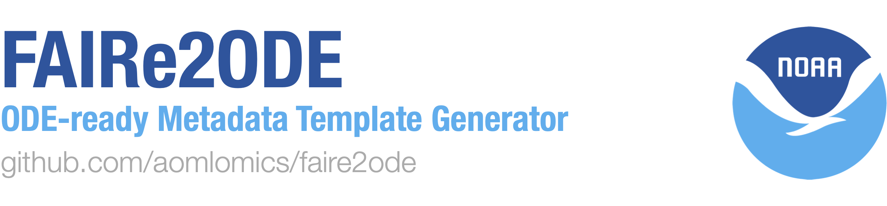

<div align="center">
  
</div>

## Introduction
FAIRe2ODE converts the FAIR eDNA ([FAIRe](https://fair-edna.github.io/index.html)) data checklist to the Ocean DNA Explorer ([ODE](https://www.oceandnaexplorer.org/)) input format. This code generates the metadata templates, which, once filled with data, are ready for ODE submission. Additionally, once your data is in ODE format you can use [edna2obis](https://github.com/aomlomics/edna2obis), for [GBIF](https://www.gbif.org/) and [OBIS](https://obis.org/) submission. 

If you are looking for FAIReSheets / which is the more generic version of this script, click [here](https://github.com/aomlomics/FAIReSheets). FAIRe is a collaborative effort in the eDNA research field to standardize its complicated data and metadata. FAIReSheets replicates the template creation from the [FAIRe-ator Repository](https://github.com/FAIR-eDNA/FAIRe-ator/tree/main) from Dr. Miwa Takahashi and Dr. Stephen Formel, except FAIReSheets outputs the template to Google Sheets rather than a Microsoft Excel spreadsheet. 

TLDR: Email bayden.willms@noaa.gov to be added to the user list and receive the link to the credentials file, create a blank Google Sheet, configure the `.env` file with your Google Sheet ID and the Git Gist URL, specify your parameters in `config.yaml` and `NOAA_config.yaml`, run FAIRe2ODE and follow the authentication workflow.

```bash
python run.py 
```

## Setup

### Access Request (Required)
Before using FAIRe2ODE, you'll need to request access. This only needs to happen once:

1. Email bayden.willms@noaa.gov
2. Include your Google account email in the request (the one you'll use to access Google Sheets)
3. You'll receive an email with a Gist URL to add to your `.env` file and confirmation that you've been added to the user list.

### Installation
This project requires Python and a few additional Python libraries. We strongly recommend using the Anaconda method for installation as it handles dependencies automatically and avoids many common issues.

#### Clone the Repository to your Computer:
First, install Git to download the project:
- [Download and install Git](https://git-scm.com/downloads)
  - During installation, select "Git from the command line and also from 3rd-party software"
  - We recommend using the "bundled OpenSSH" option during installation

Then, download the code respository:
```bash
git clone -b FAIRe2ODE https://github.com/aomlomics/FAIRe2ODE.git
cd FAIRe2ODE
```

Now, let's setup the Python dependencies using one of the two options.

#### Option 1: Install Dependencies with Anaconda **(HIGHLY RECOMMENDED)**
Anaconda is a scientific Python distribution that handles package dependencies and environment management automatically, helping users avoid common installation issues:

1. [Download and install Anaconda](https://docs.anaconda.com/anaconda/install/)
   - **IMPORTANT**: During installation, check the box that says "Add Anaconda to PATH"
   - This ensures Anaconda commands work from any directory
   - If you don't check this box, you'll be limited to using only the Anaconda Prompt

2. After installation, you have two options for running commands:

   **Option A: Using Command Prompt (Windows)**
   - Open Command Prompt (not PowerShell)
   - Navigate to the FAIRe2ODE directory
   - Run the following commands:
     ```bash
     conda init cmd.exe
     ```
   - **IMPORTANT**: Close and reopen Command Prompt after running conda init
   - Then run:
     ```bash
     conda env create -f environment.yml 
     conda activate faire2ode
     ```

   **Option B: Using Anaconda Prompt (Windows)**
   - Open Anaconda Prompt
   - Navigate to the FAIReSheets directory
   - Run:
     ```bash
     conda env create -f environment.yml 
     conda activate faire2ode
     ```

#### Option 2: Install Dependencies with pip (Recommended for programmers / code savvy individuals)
If you prefer not to use Anaconda, you can use pip (Python's package installer):

1. [Download and install Python](https://www.python.org/downloads/) 
   - **IMPORTANT**: During installation, check the box that says "Add Python to PATH"
   - This ensures Python and pip commands work from any directory
   - Pip will not work if Python is not added to PATH

2. Open Command Prompt (Windows) or Terminal (Mac/Linux)
3. Navigate to the FAIReSheets directory
4. Install the required packages:
   ```bash
   pip install -r requirements.txt
   ```
   If you see errors, try:
   ```bash
   python -m pip install -r requirements.txt
   ```

## Set Parameters

### Google Sheet Setup
1. Create a new, empty Google Sheet in your account
2. Copy the Spreadsheet ID from the URL:
   - The ID is the long string between `/d/` and `/edit` in the URL
   - For example: `https://docs.google.com/spreadsheets/d/1ABC123XYZ/edit`
   - The ID would be `1ABC123XYZ`

### Configure .env File
`.env` files store sensitive variables necessary for running the script. If these variables are properly stored in the `.env` file, they will not be visible on GitHub if you push your local repository publically. Run the script once and it will create a template `.env` file:
```bash
python run.py
```

Then edit the `.env` file to add:
1. Your Google Sheet ID
2. The Gist URL provided to you by email

The `.env` file should look like:
```
SPREADSHEET_ID=your_spreadsheet_id_here
GIST_URL=https://gist.THIS_IS_AN_EXAMPLE.com/user/hash/raw/file.json
```
The GIST_URL will be sent to you when you've been granted access to FAIRe2ODE (see first section).

### Set Parameters in config.yaml
Edit the `config.yaml` file to set your run parameters. Here you can specify things like project name, assays used, metabarcoding vs targeted approach, etc. 

Refer to the `config_TEMPLATE.yaml` for information on all the available options for input parameters. Just remember, `config.yaml` is the file actually used by the code.

## Run

Before running FAIRe2NODE, configure the `config.yaml` and `NOAA_config.yaml` files given your desired parameters. Please refer to the `config_TEMPLATE.yaml` for the available parameter options. These parameters determine the structure of your generated FAIRe template. You can also specify additional terms to add if you have relevant fields in your data that are not included in the FAIRe template. Just remember, `config_TEMPLATE.yaml` is just for you to know all the parameter options, and `config.yaml` and `NOAA_config.yaml` is what the code actually uses.

Run FAIRe2ODE from the root project directory using: 
```bash
python run.py
```
Or alternatively you can run the `run.py` script in your IDE using the Play button. If you are missing things like a `.env` file, authentication credentials, or your spreadsheet ID to edit, the script will prompt you to add those, and/or create a sample `.env` file for you to edit.

**Please note** that you must run this on your own computer, and **not** on a virtual machine or 
remote server. This code opens a login page in your web browser, where you sign in to your Google 
Drive account. If this code is run on a virtual machine, there is no available browser to open that 
login page.

### Creating a New Spreadsheet
If you want to generate a new FAIRe template after you've already created one, you have two options:

1. **Option 1: Restore the Google Sheet to blank**
   - Open your Google Sheet
   - Click on "File" > "Version history" > "See version history"
   - Find the version from before you ran FAIReSheets (when the sheet was blank)
   - Click on that version and select "Restore this version"
   - Run FAIReSheets again with the same spreadsheet ID

2. **Option 2: Create a new Google Sheet**
   - Create a new, empty Google Sheet
   - Copy the new Spreadsheet ID from the URL
   - Update the `SPREADSHEET_ID` in your `.env` file with the new ID
   - Run FAIReSheets again

## Run > Authentication

When you run FAIRe2ODE for the first time, the following will happen:

1. The tool will download the authentication credentials from the Git Gist URL sent to you via email
2. A browser window will open asking you to sign in with your Google account
3. You'll be asked to grant permission to FAIRe2ODE to access your Google Sheets
4. After granting permission, the tool will save a token for future use
5. Future runs won't require reauthentication

If you see a message saying "Google hasn't verified this app", click "Advanced" and then "Go to FAIReSheets (unsafe)" to proceed. This is normal for specialized tools that haven't gone through Google's verification process.

## Important Warnings

### DO NOT Run on Virtual Machines or Remote Servers
**IMPORTANT**: You must run this on your own computer, and **NOT** on a virtual machine or remote server. This code opens a login page in your web browser, where you sign in to your Google Drive account. If this code is run on a virtual machine, there is no available browser to open that login page.

### Avoid Using MobaXterm or Similar Tools
If you're using MobaXterm or similar tools that create virtual Linux environments:
- These tools open in a fake Linux home directory (`/home/<username>`) that doesn't map to a real Windows folder
- Instead, navigate to a real Windows path like `/drives/c/Users/<username>/Documents` before cloning
- Avoid cloning into `/home/<username>` since it won't show up in File Explorer

## Troubleshooting

### Anaconda Issues
- **Problem**: `conda` command not recognized in Command Prompt
  - **Solution**: Make sure you checked "Add Anaconda to PATH" during installation
  - If you didn't, reinstall Anaconda and check this option

- **Problem**: `conda activate` fails with "conda init" message
  - **Solution**: Run `conda init cmd.exe` in Command Prompt, then close and reopen Command Prompt

- **Problem**: Python version mismatch (e.g., you installed Anaconda with Python 3.12 but environment.yml requires 3.9)
  - **Solution**: This is okay! Conda will create an environment with Python 3.9 as specified in the environment.yml file

### Git Issues
- **Problem**: `git` command not recognized
  - **Solution**: Make sure Git is installed system-wide from git-scm.com
  - During installation, select "Git from the command line and also from 3rd-party software"
  - I highly recommend using Visual Studio Code, it also has a UI for using git

### Google Sheet Issues
- **Problem**: Can't edit the Google Sheet
  - **Solution**: Make sure you're using the Google account email you provided when requesting access, and that you checked the boxes to allow FAIRe2ODE to edit Google Sheets in your Google Drive.
- **Problem**: Errors when running FAIRe2ODE
  - **Solution**: Make sure the Google Sheet that FAIRe2ODE is editing is **empty**. You can use Google Drive's built in Restore History button before running FAIRe2ODE again, or, make a new Google Sheet and replace the Spreadsheet ID in the `.env` file. 

## Optional (recommended)

To automatically track modifications in your Google Sheet, you can use the following Apps Script. This script updates the modification timestamp and user email in the README sheet whenever an edit is made to any sheet except "README" and "Drop-down values".

### Steps to Add the Apps Script

1. Open your Google Sheet.
2. Click on `Extensions` in the menu, then select `Apps Script`.
3. Delete any code in the script editor and copy-paste the following code:

```javascript
function onEdit(e) {
  // Get the edited range and sheet
  var range = e.range;
  var sheet = range.getSheet();
  var spreadsheet = sheet.getParent();
  var sheetName = sheet.getName();
  
  // First handle the timestamp update (original functionality)
  // Skip README and Drop-down values sheets for timestamp update
  if (sheetName !== "README" && sheetName !== "Drop-down values") {
    var readmeSheet = spreadsheet.getSheetByName("README");
    if (readmeSheet) {
      // Find the Sheets in this Google Sheet section
      var data = readmeSheet.getDataRange().getValues();
      var timestampRowStart = -1;
      
      for (var i = 0; i < data.length; i++) {
        if (data[i][0] === "Sheets in this Google Sheet:") {
          timestampRowStart = i + 2; // +2 to skip the header row
          break;
        }
      }
      
      if (timestampRowStart !== -1) {
        // Find the row for the current sheet
        var sheetRow = -1;
        for (var i = timestampRowStart; i < data.length; i++) {
          if (data[i][0] === sheetName) {
            sheetRow = i + 1; // +1 because arrays are 0-indexed but sheets are 1-indexed
            break;
          }
        }
        
        if (sheetRow !== -1) {
          // Get current time in ISO format
          var now = new Date();
          var timestamp = now.toISOString();
          
          // Update the timestamp and email
          readmeSheet.getRange(sheetRow, 2).setValue(timestamp);
          readmeSheet.getRange(sheetRow, 3).setValue(Session.getActiveUser().getEmail());
        }
      }
    }
  }
  
  // Then handle the validation checks (new functionality)
  // Skip validation for README and Drop-down values sheets
  if (sheetName === "README" || sheetName === "Drop-down values") {
    return;
  }
  
  // Get all sheets
  var projectMetadataSheet = spreadsheet.getSheetByName("projectMetadata");
  var analysisMetadataSheets = spreadsheet.getSheets().filter(s => 
    s.getName().startsWith("analysisMetadata_"));
  
  if (!projectMetadataSheet || analysisMetadataSheets.length === 0) {
    return; // Exit if required sheets don't exist
  }
  
  // Get project_id from projectMetadata
  var projectIdCell = findCellByValue(projectMetadataSheet, "project_id");
  if (!projectIdCell) return;
  
  var projectId = projectMetadataSheet.getRange(projectIdCell.row, projectIdCell.col + 1).getValue();
  
  // Get assay_name values from projectMetadata
  var assayNameCell = findCellByValue(projectMetadataSheet, "assay_name");
  if (!assayNameCell) return;
  
  var assayNames = projectMetadataSheet.getRange(assayNameCell.row, assayNameCell.col + 1)
    .getValue()
    .split("|")
    .map(name => name.trim());
  
  // Clear only error-related formatting
  clearErrorFormatting(spreadsheet);
  
  // Verify project_id in all analysisMetadata sheets
  var hasProjectIdError = false;
  analysisMetadataSheets.forEach(analysisSheet => {
    var analysisProjectIdCell = findCellByValue(analysisSheet, "project_id");
    if (analysisProjectIdCell) {
      var analysisProjectId = analysisSheet.getRange(analysisProjectIdCell.row, analysisProjectIdCell.col + 1).getValue();
      if (analysisProjectId !== projectId) {
        addErrorFormatting(analysisSheet, analysisProjectIdCell.row, analysisProjectIdCell.col + 1, 
          "Project ID must match the one in projectMetadata sheet");
        hasProjectIdError = true;
      }
    }
  });
  
  // Verify assay_name values
  var hasAssayNameError = false;
  var foundAssayNames = new Set();
  
  analysisMetadataSheets.forEach(analysisSheet => {
    var analysisAssayNameCell = findCellByValue(analysisSheet, "assay_name");
    if (analysisAssayNameCell) {
      var analysisAssayName = analysisSheet.getRange(analysisAssayNameCell.row, analysisAssayNameCell.col + 1).getValue();
      if (!assayNames.includes(analysisAssayName)) {
        addErrorFormatting(analysisSheet, analysisAssayNameCell.row, analysisAssayNameCell.col + 1,
          "Assay name must match one of the values in projectMetadata sheet");
        hasAssayNameError = true;
      } else {
        foundAssayNames.add(analysisAssayName);
      }
    }
  });
  
  // Check if all assay names from projectMetadata are used
  assayNames.forEach(assayName => {
    if (!foundAssayNames.has(assayName)) {
      addErrorFormatting(projectMetadataSheet, assayNameCell.row, assayNameCell.col + 1,
        "Each assay name must be used in at least one analysisMetadata sheet");
      hasAssayNameError = true;
    }
  });

  // Verify analysis_run_name uniqueness within each sheet
  analysisMetadataSheets.forEach(analysisSheet => {
    var analysisRunNameCell = findCellByValue(analysisSheet, "analysis_run_name");
    if (analysisRunNameCell) {
      // Get all values in the column
      var data = analysisSheet.getDataRange().getValues();
      var analysisRunNameCol = analysisRunNameCell.col - 1; // Convert to 0-based index
      var analysisRunNames = new Set();
      
      // Check each row in the column
      for (var i = 0; i < data.length; i++) {
        var value = data[i][analysisRunNameCol];
        if (value && value.trim() !== "") { // Only check non-empty values
          if (analysisRunNames.has(value)) {
            // Found a duplicate
            addErrorFormatting(analysisSheet, i + 1, analysisRunNameCell.col,
              "Duplicate analysis_run_name found in this sheet");
          } else {
            analysisRunNames.add(value);
          }
        }
      }
    }
  });
  var font = "Arial"; // Set your desired font
  var fontSize = 10;  // Set your desired font size
  range.setFontFamily(font);
  range.setFontSize(fontSize);
}

// Helper function to find a cell containing a specific value
function findCellByValue(sheet, searchValue) {
  var data = sheet.getDataRange().getValues();
  for (var i = 0; i < data.length; i++) {
    for (var j = 0; j < data[i].length; j++) {
      if (data[i][j] === searchValue) {
        return {row: i + 1, col: j + 1};
      }
    }
  }
  return null;
}

// Helper function to add error formatting
function addErrorFormatting(sheet, row, col, message) {
  var cell = sheet.getRange(row, col);
  // Store the current note if it exists
  var currentNote = cell.getNote();
  // Only add the error message if it's not already there
  if (!currentNote.includes(message)) {
    cell.setNote(currentNote + (currentNote ? "\n" : "") + "ERROR: " + message);
  }
  // Add red background only if it's not already an error
  if (cell.getBackground() !== "#ff0000") {
    cell.setBackground("#ff0000"); // Light red background
  }
}

// Helper function to clear only error-related formatting
function clearErrorFormatting(spreadsheet) {
  var sheets = spreadsheet.getSheets();
  sheets.forEach(sheet => {
    var dataRange = sheet.getDataRange();
    var backgrounds = dataRange.getBackgrounds();
    var notes = dataRange.getNotes();
    
    // Clear only error-related formatting
    for (var i = 0; i < backgrounds.length; i++) {
      for (var j = 0; j < backgrounds[i].length; j++) {
        if (backgrounds[i][j] === "#ff0000") { // If it's our error background color
          var cell = sheet.getRange(i + 1, j + 1);
          // Remove only the error message from the note, keep other notes
          var note = notes[i][j];
          if (note) {
            var errorLines = note.split("\n").filter(line => !line.startsWith("ERROR:"));
            cell.setNote(errorLines.join("\n"));
          }
          cell.setBackground(null); // Remove the red background
        }
      }
    }
  });
}
```

4. Click the disk icon or `File > Save` to save the script.
5. Close the Apps Script editor.

Now, whenever you make an edit to any sheet (except "README" and "Drop-down values"), the modification timestamp and your email will be automatically updated in the README sheet.

## Disclaimer
This repository is a scientific product and is not official communication of the National Oceanic and Atmospheric Administration, or the United States Department of Commerce. All NOAA GitHub project code is provided on an 'as is' basis and the user assumes responsibility for its use. Any claims against the Department of Commerce or Department of Commerce bureaus stemming from the use of this GitHub project will be governed by all applicable Federal law. Any reference to specific commercial products, processes, or services by service mark, trademark, manufacturer, or otherwise, does not constitute or imply their endorsement, recommendation or favoring by the Department of Commerce. The Department of Commerce seal and logo, or the seal and logo of a DOC bureau, shall not be used in any manner to imply endorsement of any commercial product or activity by DOC or the United States Government.