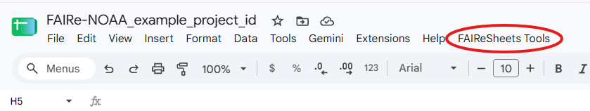
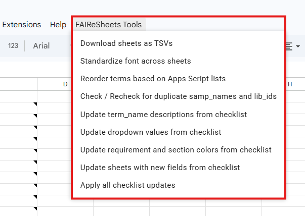

<div align="left">
  
  <br/>
  
</div>

<blockquote>
  <p><strong>Google verification update (August 5, 2026):</strong> FAIReSheets is now a Google verified OAuth app. If you have recently run into errors, please <strong>pull the latest version</strong> (<code>git pull</code>). You no longer need <code>GIST_URL</code> in your <code>.env</code> file — just your <code>SPREADSHEET_ID</code>.</p>
</blockquote>

FAIReSheets converts the FAIR eDNA ([FAIRe](https://fair-edna.github.io/index.html)) data checklist to customizable Google Sheets templates. FAIReSheets can be run in one of 2 modes:
1. **FAIR eDNA:** Generate FAIR eDNA data templates from the FAIRe checklist
2. **FAIRe-NOAA:** Generate FAIRe-NOAA data templates used for submission to the [Ocean DNA Explorer](https://www.oceandnaexplorer.org/), and used as input to [edna2obis](https://github.com/aomlomics/edna2obis), a data pipeline for submission to [GBIF](https://www.gbif.org/) and [OBIS](https://obis.org/).

NOTE: FAIReSheets generates BLANK templates. You must fill them in with data manually after they're generated.

### Official Documentation
FAIReSheets documentation is maintained by the NOAA 'Omics Data Management Guide (DMG). See the official [FAIReSheets Overview](https://noaa-omics-dmg.readthedocs.io/en/latest/fairesheets.html) and [FAIReSheets Privacy Policy](https://noaa-omics-dmg.readthedocs.io/en/latest/fairesheets-privacy.html).

### Quick Start Summary
Need help running FAIReSheets?  
[](https://youtu.be/dE2g6FswuA0?si=8UNWfRzU_hjMRMFY)

**Authentication update:** FAIReSheets is now a Google-verified OAuth app! If you previously used FAIReSheets or followed the video tutorial, you no longer need to email bayden.willms@noaa.gov for access or a Gist URL, and `GIST_URL` is no longer needed in your `.env` file. Create a blank Google Sheet, add its ID to `.env`, configure `config.yaml` and optionally `NOAA_config.yaml`, and run `python run.py`. Your browser will guide you through Google authentication on the first run.

## Who is using FAIReSheets?

FAIReSheets is now Google verified, so you no longer need to email for access, but now I don't know who is using it!

This is ``completely optional``, but we would appreciate if you reached out to us via email (bayden.willms@noaa.gov) and briefly tell us about your research and lab.

---
### Table of Contents
1. [Prerequisites](#Prerequisites)
2. [Installation](#Installation)
3. [Configuration](#Configuration)
4. [Usage](#Usage)
5. [Troubleshooting](#Troubleshooting)
---

### Prerequisites
Before using FAIReSheets, create a blank Google Sheet. FAIReSheets is verified by Google, so users no longer need to request access, join an approved-user list, or obtain authentication files through a private Git Gist.

### Installation
1. **Clone the Repository**:
   ```bash
   git clone https://github.com/aomlomics/FAIReSheets.git
   cd FAIReSheets
   ```
2. **Set up the Environment** (use **either** Conda **or** pip — both install the same Python dependencies):

   **Option A — Conda (recommended if you already use Conda):**
   - Install Conda if you don't have it already.
   - Create and activate the Conda environment:
     ```bash
     conda env create -f environment.yml
     conda activate FAIReSheets
     ```

   **Option B — pip (Python 3.11+):**
   ```bash
   pip install -r requirements.txt
   ```

### Configuration
1. **Create `.env` file**:
   - In the FAIReSheets directory, create a `.env` file. Alternatively, run FAIReSheets without one and the file will be created for you. You will still need to add your Spreadsheet ID.
2. **Configure `.env` file**:
   - Open the `.env` file and add the following, replacing the placeholder text with your actual information:
     ```
     SPREADSHEET_ID=your_spreadsheet_id_here
     ```
   - `SPREADSHEET_ID`: This is the ID of the Google Sheet you want to populate. You can find it in the URL of your Google Sheet, between the **/d/** and **/edit**: `https://docs.google.com/spreadsheets/d/SPREADSHEET_ID/edit`.
   - Existing users may remove the deprecated `GIST_URL` entry from their `.env` file; FAIReSheets no longer reads it.

3. **Customize your FAIRe checklist:**
   - The FAIRe data checklist is designed to be customizable. If you have data fields that are not included in the checklist, you can manually add them into the checklist as User Defined fields, and your changes will be reflected in the templates you generate. We recommend trying your best to align your custom fields with fields in existing eDNA data standards, like Darwin Core or MIXs.

### Usage

FAIReSheets can generate **EITHER** FAIR eDNA templates, **OR** FAIRe-NOAA templates. See more info in the bullet points below:
- **FAIR eDNA:** The default mode of FAIReSheets, this will generate the exact format supported by the [FAIR eDNA collaboration](https://fair-edna.github.io/index.html). Parameters for the template are set in the `config.yaml` file. HINT: for users with qPCR data, this is what you want!
- **FAIRe-NOAA:** Generates templates in the FAIRe-NOAA format used by the [Ocean DNA Explorer](https://www.oceandnaexplorer.org/), NOAA 'Omics own eDNA data portal. Submission to ODE will unlock your data's potential, with an intuitive user interface, data visualizations, search, API endpoints, and more! These data templates can also be used as input to [edna2obis](https://github.com/aomlomics/edna2obis), a data pipeline for submission to [GBIF](https://www.gbif.org/) and [OBIS](https://obis.org/). This workflow now also generates a `taxaFinal` sheet. Parameters for the template are set in the `NOAA_config.yaml` file. HIGHLY RECOMMENDED to any user with metabarcoding / targeted eDNA data!


Customize your generated data templates depending on your data:
 - Open `config.yaml` and `NOAA_config.yaml` to set your project-specific parameters.
 - Comments in the files explain what each parameter does.
- `config.yaml` is for FAIR eDNA template parameters.
- `NOAA_config.yaml` is for FAIRe-NOAA template parameters.

If you would like to generate FAIRe-NOAA templates, set the `run_noaa_formatting` config parameter to `true`, like this: 
```bash 
run_noaa_formatting: true
```

You are now ready to run the code! Run FAIReSheets from the root project directory using: 
```bash
python run.py
```
This will:
1. Generate the data templates in your specified Google Sheet.
2. If `run_noaa_formatting` is `true` in `NOAA_config.yaml`, it will then convert the sheet to the FAIRe-NOAA format used by the Ocean DNA Explorer.

#### First-Time Authentication
When you run FAIReSheets for the first time, the following will happen:
1. A browser window will open, prompting you to log in to your Google account. 
2. Google will identify FAIReSheets as a verified app and ask you to grant it permission to access your Google Sheets.
3. Once you grant permission, a `token.json` file will be created in the project directory. This file stores your authentication token, so you won't have to log in every time you run the tool. Do not share or commit this file.

### Troubleshooting
- **Problem**: Older instructions say to request access or configure `GIST_URL` by emailing bayden.willms@noaa.gov. Do I still need to do that?
  - **Solution**: These authentication steps are deprecated. Please 'git pull' the latest version of FAIReSheets, remove `GIST_URL` from your local `.env`, and run the application to use the new verified browser authentication flow.
- **Problem**: Authentication errors (e.g., "invalid_grant")
  - **Solution**: Delete the `token.json` file and run the tool again. This will re-trigger the authentication process.
  - **Solution**: Make sure you granted FAIReSheets permission to edit Google Sheets.
- **Problem**: Errors when running FAIReSheets
  - **Solution**: Make sure the Google Sheet that FAIReSheets is editing is **EMPTY**. You can use Google Drive's built in Restore History button before running FAIReSheets again, or, make a new Google Sheet and replace the Spreadsheet ID in the `.env` file. 

## Optional (recommended): Google Apps Script

<div align="left">
  
</div>

Follow the instructions below to add a **FAIReSheets Tools** menu to your Google Sheets page. It covers TSV download (needed for [Ocean DNA Explorer](https://www.oceandnaexplorer.org/) and [edna2obis](https://github.com/aomlomics/edna2obis)), reordering columns or fields, duplicate checks, and checklist updates (notes, dropdowns, colors, and new fields).

### Updating the `checklist` tab on an existing Google Sheet

Put the new checklist `.xlsx` in `input/`, then export it to CSV:

```bash
python export_checklist.py FAIRe_NOAA_checklist_v1.0.3.xlsx
```

That writes `input/checklist.csv` (same table as the `checklist` tab FAIReSheets generates).

#### Import `checklist.csv` into Google Sheets (File → Import)

Do **not** copy and paste the checklist. Instead:

1. Open your FAIRe Google Sheet in the browser.
2. Click the **`checklist`** tab at the bottom so it is the active sheet.
3. **File → Import** (spreadsheet menu bar at the top).
4. In the import window, open the **Upload** tab.
5. Select `input/checklist.csv` on your computer (for example `FAIReSheets\input\checklist.csv`).
6. **Import location:** **Replace current sheet**.
7. **Separator type:** **Comma**. Click **Import data**.

**Alternative:** Upload `checklist.csv` to Google Drive first. In step 4, use the **My Drive** tab instead of Upload. Keep **Replace current sheet** with the `checklist` tab selected.

**Check it worked:** Row 1 is headers (`data_type`, `term_name`, …). You should have 400+ data rows across many columns. If all text is in column A only, you pasted instead of importing.

The Apps Script reads this tab for checklist updates (notes, dropdowns, colors, new fields). When a new checklist is published, repeat export + import to refresh the tab.

### Adding the Google Apps Script

1. Open your Google Sheet.
2. **Extensions → Apps Script**.
3. Delete any existing code. Copy the **full** script below, starting at `const REFERENCE_SHEETS`.
4. Save (**File → Save**, or the disk icon).
5. **CLOSE the Google Sheet and reopen it.** You will see a FAIReSheets Tools tab appear on your browser:

<div align="left">
  
</div>

Google may ask you to authorize the script the first time you run a tool.

### FAIReSheets Tools menu

<div align="left">
  
</div>

#### Change column or field order

**Reorder terms based on Apps Script lists** moves existing columns or rows **in place**. It does not add or delete fields, and it does not change cell values. Dropdowns, notes, and colors stay with the field. You can run it on a blank template or after you have filled in data.

The order comes from `COLUMN_OR_FIELD_ORDER` in the Apps Script (search for that name). There are four lists:

- **sampleMetadata** and **experimentRunMetadata:** these are **column** headers. Listed fields move to the **left**, in the order you write them.
- **projectMetadata** and **analysisMetadata:** these are **term_name** values (**rows**). Listed fields move to the **top**, in the order you write them. Every sheet whose name starts with `analysisMetadata` uses the analysis list.

Anything you do **not** list stays where it is, after the listed fields. A name that is not on the sheet is skipped (no error). Keep the lists short if you only want to pin a few fields first, or list every term if you want a full order.

**To use it:**

1. **Extensions → Apps Script.**
2. Find `const COLUMN_OR_FIELD_ORDER`.
3. Edit the quoted names. Keep the commas and quotes. Save (**File → Save**, or the disk icon).
4. In the Google Sheet, **FAIReSheets Tools → Reorder terms based on Apps Script lists**. Click **Continue**.

If the sheet has merged cells, reorder is skipped for that sheet and the merged ranges are highlighted yellow. Unmerge them and run the menu item again.

```javascript
const REFERENCE_SHEETS = ["README", "Drop-down values", "checklist"];
const REQ_COLORS = { M: "#E26B0A", HR: "#FFCC00", R: "#FFFF99", O: "#CCFF99" };
const TARGETED_SECTIONS = ["Targeted assay detection"];
const METABARCODING_SECTIONS = ["Library preparation sequencing", "Bioinformatics", "OTU/ASV"];
const FAIRE_ICON_URL = "https://raw.githubusercontent.com/aomlomics/FAIReSheets/main/src/helpers/fairesheets_icon_final.png";

function escapeHtml_(s) {
  return String(s || "")
    .replace(/&/g, "&amp;")
    .replace(/</g, "&lt;")
    .replace(/>/g, "&gt;")
    .replace(/"/g, "&" + "quot;");
}

function reportToHtml_(text) {
  const lines = String(text || "").split("\n");
  let html = "";
  let items = [];
  function flushItems() {
    if (!items.length) return;
    if (items.length === 1) html += "<p>" + escapeHtml_(items[0]) + "</p>";
    else {
      html += "<ul>";
      items.forEach(line => {
        html += "<li>" + escapeHtml_(line) + "</li>";
      });
      html += "</ul>";
    }
    items = [];
  }
  lines.forEach(raw => {
    const line = String(raw || "").replace(/\s+$/, "");
    if (!line) {
      flushItems();
      return;
    }
    const isHead = /:$/.test(line) && line.indexOf(": ") === -1;
    if (isHead) {
      flushItems();
      html += "<p><b>" + escapeHtml_(line) + "</b></p>";
      return;
    }
    items.push(line);
  });
  flushItems();
  return html || "<p>Done.</p>";
}

function popupShell_(bodyHtml, toolId) {
  const hasRun = !!toolId;
  return `<!DOCTYPE html>
<html><head><base target="_top">
<style>
body{margin:0;font-family:Arial,sans-serif;font-size:15px;line-height:1.45;color:#222;}
.wrap{padding:20px 22px 18px;}
.head{margin:0 0 16px;}
.head img{width:96px;height:96px;}
.scroll{max-height:300px;overflow:auto;}
.scroll ul{margin:6px 0 12px 20px;padding:0;}
.scroll li{margin:0 0 6px;}
.scroll p{margin:0 0 10px;}
.btns{margin-top:16px;}
button{font-family:Arial,sans-serif;font-size:14px;padding:8px 16px;margin-right:8px;}
#status{margin-top:10px;}
.working{display:flex;align-items:center;gap:10px;color:#174ea6;font-size:14px;}
.spinner{width:22px;height:22px;border:3px solid #c5d5f0;border-top-color:#174ea6;border-radius:50%;animation:faire-spin .75s linear infinite;flex-shrink:0;}
@keyframes faire-spin{to{transform:rotate(360deg);}}
</style></head><body>
<div class="wrap">
  <div class="head"></div>
  <div id="main" class="scroll">${bodyHtml}</div>
  <div class="btns" id="btns">
    ${hasRun
      ? '<button type="button" onclick="go()">Continue</button><button type="button" onclick="google.script.host.close()">Cancel</button>'
      : '<button type="button" onclick="google.script.host.close()">Close</button>'}
  </div>
  <div id="status"></div>
</div>
<script>
var toolId = ${JSON.stringify(toolId || "")};
function setWorking() {
  document.getElementById("status").innerHTML = '<div class="working"><div class="spinner"></div><span>Working...</span></div>';
}
function clearWorking() {
  document.getElementById("status").innerHTML = "";
}
function go() {
  document.getElementById("btns").style.display = "none";
  setWorking();
  google.script.run.withSuccessHandler(done).withFailureHandler(fail).runNamedTool(toolId);
}
function done(res) {
  clearWorking();
  if (typeof res === "string") res = { html: res };
  document.getElementById("main").innerHTML = (res.html || "") + (res.previewHtml || "");
  var btns = document.getElementById("btns");
  btns.style.display = "block";
  if (res.append) {
    btns.innerHTML = '<button type="button" onclick="doAppend()">Append fields</button><button type="button" onclick="google.script.host.close()">Skip</button>';
  } else {
    btns.innerHTML = '<button type="button" onclick="google.script.host.close()">Close</button>';
  }
}
function doAppend() {
  document.getElementById("btns").style.display = "none";
  setWorking();
  google.script.run.withSuccessHandler(function(html) {
    clearWorking();
    document.getElementById("main").innerHTML = html;
    var btns = document.getElementById("btns");
    btns.style.display = "block";
    btns.innerHTML = '<button type="button" onclick="google.script.host.close()">Close</button>';
  }).withFailureHandler(fail).appendMissingFieldsNow();
}
function fail(err) {
  clearWorking();
  document.getElementById("main").innerHTML = "<p>" + escapeHtml_(err && err.message ? err.message : String(err)) + "</p>";
  var btns = document.getElementById("btns");
  btns.style.display = "block";
  btns.innerHTML = '<button type="button" onclick="google.script.host.close()">Close</button>';
}
function escapeHtml_(s) {
  return String(s || "").replace(/&/g,"&amp;").replace(/</g,"&lt;").replace(/>/g,"&gt;");
}
</script>
</body></html>`;
}

function showToolPopup_(title, bodyHtml, toolId) {
  SpreadsheetApp.getUi().showModalDialog(
    HtmlService.createHtmlOutput(popupShell_(bodyHtml, toolId)).setWidth(520).setHeight(480),
    title
  );
}

function showInfoPopup_(title, bodyHtml) {
  showToolPopup_(title, bodyHtml, "");
}

function needChecklist_() {
  if (SpreadsheetApp.getActiveSpreadsheet().getSheetByName("checklist")) return true;
  showInfoPopup_("Checklist", "<p>No checklist tab. Import a checklist CSV onto a sheet named checklist.</p>");
  return false;
}

function runNamedTool(toolId) {
  const ss = SpreadsheetApp.getActiveSpreadsheet();
  if (toolId === "export") return { html: reportToHtml_(exportSheetsAsTsv_(ss)) };
  if (toolId === "reorder") return { html: reportToHtml_(reorderMetadataSheets_(ss)) };
  if (toolId === "notes") return { html: reportToHtml_(updateFieldDescriptionsFromChecklist_(ss)) };
  if (toolId === "dropdowns") return { html: reportToHtml_(updateDropdownsFromChecklist_(ss)) };
  if (toolId === "colors") return { html: reportToHtml_(updateRequirementColorsFromChecklist_(ss)) };
  if (toolId === "append") return { html: reportToHtml_(appendMissingFields_(planMissingFields_(ss))) };
  if (toolId === "apply") {
    const text = [
      "Field descriptions:",
      updateFieldDescriptionsFromChecklist_(ss),
      "",
      "Dropdowns:",
      updateDropdownsFromChecklist_(ss),
      "",
      "Requirement colors and sections:",
      updateRequirementColorsFromChecklist_(ss),
    ].join("\n");
    const plan = planMissingFields_(ss);
    const n = countToAdd_(plan);
    return {
      html: reportToHtml_(text) + (n ? "" : reportToHtml_(appendMissingFields_(plan))),
      append: n > 0,
      previewHtml: n ? formatAppendPreviewHtml_(plan) : "",
    };
  }
  return { html: "<p>Unknown tool.</p>" };
}

function appendMissingFieldsNow() {
  return reportToHtml_(appendMissingFields_(planMissingFields_(SpreadsheetApp.getActiveSpreadsheet())));
}

function onOpen() {
  SpreadsheetApp.getUi()
      .createMenu('FAIReSheets Tools')
      .addItem('Download sheets as TSVs', 'exportSheetsAsTsv')
      .addItem('Standardize font across sheets', 'standardizeFontAcrossAllSheets')
      .addItem('Reorder terms based on Apps Script lists', 'reorderMetadataSheets')
      .addItem('Check / Recheck for duplicate samp_names and lib_ids', 'highlightDuplicates')
      .addItem('Update term_name descriptions from checklist', 'updateFieldDescriptionsFromChecklist')
      .addItem('Update dropdown values from checklist', 'updateDropdownsFromChecklist')
      .addItem('Update requirement and section colors from checklist', 'updateRequirementColorsFromChecklist')
      .addItem('Update sheets with new fields from checklist', 'appendMissingFieldsFromChecklist')
      .addItem('Apply all checklist updates', 'applyChecklist')
      .addToUi();
  standardizeFontAcrossAllSheetsOnce_();
}

/**
 * Column/field ordering lists (optional).
 *
 * - sampleMetadata / experimentRunMetadata: these are COLUMN headers to move to the front in this order.
 * - projectMetadata / analysisMetadata: these are term_name values (ROWS) to move to the top in this order.
 *
 * Anything not listed is left in place (and the script will NOT error if a listed item is missing).
 *
 * Tip: you can keep these short (just "pin" your most important fields first), or make them exhaustive.
 */
const COLUMN_OR_FIELD_ORDER = {
  projectMetadata: [
// Core project information
    "project_id",
    "project_name",
    "parent_project_id",
    "institution",
    "institutionID",
    "recordedBy",
    "recordedByID",
    "project_contact",
    "sample_type",    
    "study_factor",
    "expedition_id",
    "ship_crs_expocode",
    "woce_sect",
    "bioproject_accession",
    "projectDescription", 
    "dataDescription",
// Data Management Info    
    "checkls_ver",
    "mod_date",
    "license",
    "rightsHolder",
    "accessRights",
    "informationWithheld",
    "dataGeneralizations",
    "bibliographicCitation",
    "associated_resource",
    "code_repo",
    "biological_rep",
// Assay and PCR Info
    "assay_name",
    "assay_type",
    "assay_name_alternate",
    "assay_reference",
    "sterilise_method",
    "neg_cont_0_1",
    "pos_cont_0_1",
    "pcr_primer_forward",
    "pcr_primer_reverse",
    "pcr_primer_name_forward",
    "pcr_primer_name_reverse",
    "pcr_primer_reference_forward",
    "pcr_primer_reference_reverse",
    "pcr_primer_name_published_forward",
    "pcr_primer_name_published_reverse",
    "pcr_primer_vol_forward",
    "pcr_primer_vol_reverse",
    "pcr_primer_conc_forward",
    "pcr_primer_conc_reverse",
    "pcr_0_1",
    "inhibition_check_0_1",
    "inhibition_check",
    "targetTaxonomicAssay",
    "targetTaxonomicScope",
    "target_gene",
    "target",
  ],
  sampleMetadata: [
    "samp_name",
    "sample_type",
    "samp_category",
    "pos_cont_type",
    "neg_cont_type",
    "short_name",
    "expedition_id",
    "expeditionName",
    "expeditionURL",
    "expeditionStartDate",
    "expeditionEndDate",
    "expeditionLocation",
    "materialSampleID",
    "sample_derived_from",
    "sample_composed_of",
    "rel_cont_id",
    "biological_rep_relation",
    "eventDate",
    "eventDurationValue",
    "verbatimEventDate",
    "verbatimEventTime",
    "country",
    "geo_loc_name",
    "locality",
    "env_medium",
    "env_broad_scale",
    "env_local_scale",
  ],
  experimentRunMetadata: [
    "samp_name",
    "lib_id",
    "assay_name",
    "seq_run_id",
    "pcr_plate_id",
  ],
  analysisMetadata: [
    "project_id",
    "assay_name",
    "analysis_run_name",
  ],
};

function standardizeFontAcrossAllSheetsOnce_() {
  const props = PropertiesService.getDocumentProperties();
  const key = "FAIRESHEETS_FONT_STANDARDIZED_V1";
  if (props.getProperty(key) === "true") return;
  standardizeFontAcrossAllSheets();
  props.setProperty(key, "true");
}

function standardizeFontAcrossAllSheets() {
  SpreadsheetApp.getActiveSpreadsheet().getSheets().forEach(sheet => {
    const rows = sheet.getMaxRows();
    const cols = sheet.getMaxColumns();
    if (rows < 1 || cols < 1) return;
    sheet.getRange(1, 1, rows, cols).setFontFamily("Arial").setFontSize(10);
  });
}

function exportSheetsAsTsv() {
  showToolPopup_(
    "Download sheets as TSVs",
    "<p>Saves TSV files to a new folder in My Drive.</p><p>README, Dropdown values, and checklist are skipped.</p>",
    "export"
  );
}

function exportSheetsAsTsv_(spreadsheet) {
  const spreadsheetName = spreadsheet.getName();
  const timestamp = Utilities.formatDate(new Date(), Session.getScriptTimeZone(), "yyyyMMdd_HHmm");
  const folderName = spreadsheetName + "_TSVs_" + timestamp;
  const folder = DriveApp.getRootFolder().createFolder(folderName);
  const filesCreated = [];
  const errors = [];
  spreadsheet.getSheets().forEach(sheet => {
    const sheetName = sheet.getName();
    if (REFERENCE_SHEETS.includes(sheetName)) return;
    const fileName = `${spreadsheetName}_${sheetName}.tsv`;
    const tsvContent = sheet
      .getDataRange()
      .getValues()
      .map(row => row.map(cell => cell.toString().replace(/[\t\n]/g, " ")).join("\t"))
      .join("\n");
    try {
      folder.createFile(fileName, tsvContent, MimeType.PLAIN_TEXT);
      filesCreated.push(fileName);
    } catch (e) {
      errors.push(`Error for sheet "${sheetName}": ${e.message}`);
    }
  });
  const lines = [];
  if (filesCreated.length) {
    lines.push(`Exported ${filesCreated.length} sheets to "${folderName}".`);
    filesCreated.forEach(f => lines.push(f));
  } else {
    lines.push("No sheets were exported.");
  }
  errors.forEach(e => lines.push(e));
  return lines.join("\n");
}

function onEdit(e) {
  const sheet = e.range.getSheet();
  const sheetName = sheet.getName();
  if (REFERENCE_SHEETS.includes(sheetName)) return;

  const spreadsheet = sheet.getParent();
  updateModificationTimestamp(spreadsheet, sheetName);
  e.range.setFontFamily("Arial").setFontSize(10);

  if (sheetName === "projectMetadata" || sheetName.startsWith("analysisMetadata")) {
    validateSheetData(spreadsheet);
  }
}

function updateModificationTimestamp(spreadsheet, editedSheetName) {
  const readmeSheet = spreadsheet.getSheetByName("README");
  if (!readmeSheet) return;

  const data = readmeSheet.getDataRange().getValues();
  let listStart = -1;
  for (let i = 0; i < data.length; i++) {
    const label = data[i][0];
    if (label === "Sheets in this Google Sheet:" || label === "Modification Timestamp:") {
      listStart = i + 2;
      break;
    }
  }
  if (listStart === -1) return;

  for (let i = listStart; i < data.length; i++) {
    if (data[i][0] === editedSheetName) {
      const row = i + 1;
      readmeSheet.getRange(row, 2).setValue(new Date().toISOString());
      readmeSheet.getRange(row, 3).setValue(Session.getActiveUser().getEmail());
      break;
    }
  }
}

function findCellByValue(sheet, searchValue) {
  const data = sheet.getDataRange().getValues();
  for (let i = 0; i < data.length; i++) {
    for (let j = 0; j < data[i].length; j++) {
      if (data[i][j] === searchValue) return { row: i + 1, col: j + 1 };
    }
  }
  return null;
}

function validateSheetData(spreadsheet) {
  const projectSheet = spreadsheet.getSheetByName("projectMetadata");
  const analysisSheets = spreadsheet.getSheets().filter(s => s.getName().startsWith("analysisMetadata_"));
  if (!projectSheet || !analysisSheets.length) return;

  const projectIdCell = findCellByValue(projectSheet, "project_id");
  const assayNameCell = findCellByValue(projectSheet, "assay_name");
  if (!projectIdCell || !assayNameCell) return;

  const projectId = projectSheet.getRange(projectIdCell.row, projectIdCell.col + 1).getValue();
  const assayNames = projectSheet
    .getRange(assayNameCell.row, assayNameCell.col + 1)
    .getValue()
    .toString()
    .split("|")
    .map(name => name.trim());

  clearErrorFormatting([projectSheet].concat(analysisSheets));

  const foundAssayNames = new Set();
  analysisSheets.forEach(analysisSheet => {
    const analysisProjectIdCell = findCellByValue(analysisSheet, "project_id");
    if (analysisProjectIdCell) {
      const analysisProjectId = analysisSheet.getRange(analysisProjectIdCell.row, analysisProjectIdCell.col + 1).getValue();
      if (analysisProjectId !== projectId) {
        addErrorFormatting(
          analysisSheet,
          analysisProjectIdCell.row,
          analysisProjectIdCell.col + 1,
          "Project ID must match the one in projectMetadata sheet"
        );
      }
    }

    const analysisAssayNameCell = findCellByValue(analysisSheet, "assay_name");
    if (analysisAssayNameCell) {
      const analysisAssayName = analysisSheet.getRange(analysisAssayNameCell.row, analysisAssayNameCell.col + 1).getValue();
      if (!assayNames.includes(analysisAssayName)) {
        addErrorFormatting(
          analysisSheet,
          analysisAssayNameCell.row,
          analysisAssayNameCell.col + 1,
          "Assay name must match one of the values in projectMetadata sheet"
        );
      } else {
        foundAssayNames.add(analysisAssayName);
      }
    }

    const analysisRunNameCell = findCellByValue(analysisSheet, "analysis_run_name");
    if (analysisRunNameCell) {
      const data = analysisSheet.getDataRange().getValues();
      const colIndex = analysisRunNameCell.col - 1;
      const seen = new Set();
      for (let i = 0; i < data.length; i++) {
        const value = data[i][colIndex];
        if (!value || !value.toString().trim()) continue;
        if (seen.has(value)) {
          addErrorFormatting(analysisSheet, i + 1, analysisRunNameCell.col, "Duplicate analysis_run_name found in this sheet");
        } else {
          seen.add(value);
        }
      }
    }
  });

  assayNames.forEach(assayName => {
    if (assayName && !foundAssayNames.has(assayName)) {
      addErrorFormatting(
        projectSheet,
        assayNameCell.row,
        assayNameCell.col + 1,
        `Assay name "${assayName}" must be used in an analysisMetadata sheet`
      );
    }
  });
}

function addErrorFormatting(sheet, row, col, message) {
  const cell = sheet.getRange(row, col);
  const currentNote = cell.getNote();
  const errorMessage = "ERROR: " + message;
  if (!currentNote.includes(errorMessage)) {
    cell.setNote(currentNote + (currentNote ? "\n" : "") + errorMessage);
  }
  cell.setBackground("#ff0000");
}

function clearErrorFormatting(sheets) {
  sheets.forEach(sheet => {
    const range = sheet.getDataRange();
    const backgrounds = range.getBackgrounds();
    const notes = range.getNotes();
    for (let i = 0; i < backgrounds.length; i++) {
      for (let j = 0; j < backgrounds[i].length; j++) {
        if (backgrounds[i][j] !== "#ff0000") continue;
        const cell = sheet.getRange(i + 1, j + 1);
        if (notes[i][j]) {
          cell.setNote(notes[i][j].split("\n").filter(line => !line.startsWith("ERROR:")).join("\n"));
        }
        cell.setBackground(null);
      }
    }
  });
}

function reorderMetadataSheets() {
  showToolPopup_(
    "Reorder terms",
    "<p>Moves existing rows/columns in place on projectMetadata, sampleMetadata, experimentRunMetadata, and analysisMetadata*.</p><p>Missing terms are skipped. Dropdowns and formatting stay with the fields.</p>",
    "reorder"
  );
}

function reorderMetadataSheets_(spreadsheet) {
  const results = [];
  function reorderIfNoMerges(sheet, reorderFn, orderList, label) {
    if (!sheet) {
      results.push(`Skipped "${label}" (sheet not found).`);
      return;
    }
    const merged = sheet.getRange(1, 1, sheet.getMaxRows(), sheet.getMaxColumns()).getMergedRanges();
    if (merged.length) {
      merged.forEach(range => {
        range.setBackground("yellow");
        appendHighlightNote_(
          range,
          "Merged cells block reordering. Unmerge this range, then run Reorder again."
        );
      });
      results.push(`Skipped "${label}": ${merged.length} merged range(s) highlighted in yellow. Unmerge and run again.`);
      return;
    }
    results.push(reorderFn(sheet, orderList, label));
  }

  reorderIfNoMerges(
    spreadsheet.getSheetByName("projectMetadata"),
    reorderLongFormByTermName_,
    COLUMN_OR_FIELD_ORDER.projectMetadata,
    "projectMetadata"
  );
  reorderIfNoMerges(
    spreadsheet.getSheetByName("sampleMetadata"),
    reorderWideFormByHeader_,
    COLUMN_OR_FIELD_ORDER.sampleMetadata,
    "sampleMetadata"
  );
  reorderIfNoMerges(
    spreadsheet.getSheetByName("experimentRunMetadata"),
    reorderWideFormByHeader_,
    COLUMN_OR_FIELD_ORDER.experimentRunMetadata,
    "experimentRunMetadata"
  );

  const analysisSheets = spreadsheet.getSheets().filter(s => s.getName().startsWith("analysisMetadata"));
  if (!analysisSheets.length) {
    results.push('Skipped "analysisMetadata*" (no matching sheets found).');
  } else {
    analysisSheets.forEach(s =>
      reorderIfNoMerges(s, reorderLongFormByTermName_, COLUMN_OR_FIELD_ORDER.analysisMetadata, s.getName())
    );
  }

  return results.filter(Boolean).join("\n");
}

function checklistCol_(headers, name) {
  return headers.indexOf(name);
}

function checklistCell_(row, headers, name) {
  const idx = checklistCol_(headers, name);
  if (idx < 0) return "";
  return (row[idx] || "").toString().trim();
}

function noteFromChecklistRow_(row, headers) {
  const req = checklistCell_(row, headers, "requirement_level");
  const cond = checklistCell_(row, headers, "requirement_level_condition");
  const desc = checklistCell_(row, headers, "description");
  const example = checklistCell_(row, headers, "example");
  const termType = checklistCell_(row, headers, "term_type");
  const cv = checklistCell_(row, headers, "controlled_vocabulary_options");
  const fmt = checklistCell_(row, headers, "fixed_format");
  const parts = [];
  if (req) parts.push(cond ? `Requirement level: ${req} (${cond})` : `Requirement level: ${req}`);
  if (desc) parts.push(`Description: ${desc}`);
  if (example) parts.push(`Example: ${example}`);
  if (termType === "controlled vocabulary" && cv) {
    parts.push(`Field type: ${termType} (${cv})`);
  } else if (termType === "fixed format" && fmt) {
    parts.push(`Field type: ${termType} (${fmt})`);
  } else if (termType) {
    parts.push(`Field type: ${termType}`);
  }
  return parts.join("\n");
}

function checklistNoteByTerm_(spreadsheet) {
  const sheet = spreadsheet.getSheetByName("checklist");
  if (!sheet || sheet.getLastRow() < 2) return {};

  const headers = sheet.getRange(1, 1, 1, sheet.getLastColumn()).getValues()[0].map(v => (v || "").toString().trim());
  if (checklistCol_(headers, "term_name") < 0) return {};

  const rows = sheet.getRange(2, 1, sheet.getLastRow() - 1, sheet.getLastColumn()).getValues();
  const byTerm = {};
  rows.forEach(row => {
    const term = checklistCell_(row, headers, "term_name");
    const note = noteFromChecklistRow_(row, headers);
    if (term && note && byTerm[term] == null) byTerm[term] = note;
  });
  return byTerm;
}

function checklistTermKey_(term) {
  const key = (term || "").toString().trim();
  if (key.startsWith("detected_notDetected_")) return "detected_notDetected";
  return key;
}

function updateWideSheetNotes_(sheet, noteByTerm) {
  const lastCol = sheet.getLastColumn();
  if (lastCol < 1) return `Skipped "${sheet.getName()}" (empty sheet).`;

  const headerRow = 3;
  const headers = sheet.getRange(headerRow, 1, 1, lastCol).getValues()[0];
  const notes = sheet.getRange(headerRow, 1, 1, lastCol).getNotes()[0].slice();
  let updated = 0;
  let matched = 0;
  let missing = 0;
  headers.forEach((header, i) => {
    const term = (header || "").toString().trim();
    if (!term) return;
    const note = noteByTerm[checklistTermKey_(term)];
    if (!note) {
      missing += 1;
      return;
    }
    matched += 1;
    if (notes[i] !== note) {
      notes[i] = note;
      updated += 1;
    }
  });
  if (updated) sheet.getRange(headerRow, 1, 1, lastCol).setNotes([notes]);
  return `"${sheet.getName()}": updated ${updated} note(s); matched ${matched} field(s); no checklist row for ${missing} field(s).`;
}

function updateLongFormNotes_(sheet, noteByTerm) {
  const lastRow = sheet.getLastRow();
  const lastCol = sheet.getLastColumn();
  if (lastRow < 2 || lastCol < 1) return `Skipped "${sheet.getName()}" (no data rows).`;

  const headers = sheet.getRange(1, 1, 1, lastCol).getValues()[0].map(v => (v || "").toString().trim());
  let termCol = headers.indexOf("term_name") + 1;
  if (termCol < 1) termCol = findCellByValue(sheet, "term_name")?.col || 0;
  if (termCol < 1) return `Skipped "${sheet.getName()}" (could not find "term_name" column).`;

  const terms = sheet.getRange(2, termCol, lastRow - 1, 1).getValues();
  const notes = sheet.getRange(2, termCol, lastRow - 1, 1).getNotes();
  let updated = 0;
  let matched = 0;
  let missing = 0;
  terms.forEach((row, i) => {
    const term = (row[0] || "").toString().trim();
    if (!term) return;
    const note = noteByTerm[checklistTermKey_(term)];
    if (!note) {
      missing += 1;
      return;
    }
    matched += 1;
    if (notes[i][0] !== note) {
      notes[i][0] = note;
      updated += 1;
    }
  });
  if (updated) sheet.getRange(2, termCol, lastRow - 1, 1).setNotes(notes);
  return `"${sheet.getName()}": updated ${updated} note(s); matched ${matched} field(s); no checklist row for ${missing} field(s).`;
}

function forEachMetadataSheet_(spreadsheet, visit) {
  const namedSheets = [
    "projectMetadata",
    "sampleMetadata",
    "experimentRunMetadata",
    "taxaRaw",
    "taxaFinal",
    "stdData",
    "eLowQuantData",
    "ampData",
  ];
  const seen = {};
  function visitOne(sheet) {
    if (!sheet || seen[sheet.getName()]) return;
    seen[sheet.getName()] = true;
    visit(sheet);
  }
  namedSheets.forEach(name => visitOne(spreadsheet.getSheetByName(name)));
  spreadsheet.getSheets().forEach(sheet => {
    if (sheet.getName().startsWith("analysisMetadata")) visitOne(sheet);
  });
}

function runPerMetadataSheet_(spreadsheet, byTerm, wideFn, longFn, emptyMsg) {
  const n = Object.keys(byTerm || {}).length;
  if (!n) return emptyMsg;
  const results = [`Loaded ${n} checklist field(s) from the checklist sheet.`];
  forEachMetadataSheet_(spreadsheet, sheet => {
    results.push((isWideMetadataSheetLayout_(sheet) ? wideFn : longFn)(sheet, byTerm));
  });
  return results.join("\n");
}

function runChecklistMenu_(title, bodyHtml, toolId) {
  if (!needChecklist_()) return;
  showToolPopup_(title, bodyHtml, toolId);
}

function updateFieldDescriptionsFromChecklist_(spreadsheet) {
  return runPerMetadataSheet_(
    spreadsheet,
    checklistNoteByTerm_(spreadsheet),
    updateWideSheetNotes_,
    updateLongFormNotes_,
    "No checklist sheet (or no term_name rows) found, so notes were not updated."
  );
}

function updateFieldDescriptionsFromChecklist() {
  runChecklistMenu_(
    "Update term_name descriptions",
    "<p>Rebuilds hover notes from the checklist tab.</p><p>Cell values are not changed.</p>",
    "notes"
  );
}

function isChecklistDropdownTerm_(termType) {
  const t = (termType || "").toString().trim().toLowerCase();
  return t === "controlled vocabulary" || t === "boolean";
}

function splitVocabOptions_(cv) {
  return (cv || "")
    .toString()
    .split("|")
    .map(s => s.trim())
    .filter(s => s);
}

function checklistVocabByTerm_(spreadsheet) {
  const sheet = spreadsheet.getSheetByName("checklist");
  if (!sheet || sheet.getLastRow() < 2) return {};

  const headers = sheet.getRange(1, 1, 1, sheet.getLastColumn()).getValues()[0].map(v => (v || "").toString().trim());
  if (checklistCol_(headers, "term_name") < 0) return {};

  const rows = sheet.getRange(2, 1, sheet.getLastRow() - 1, sheet.getLastColumn()).getValues();
  const byTerm = {};
  rows.forEach(row => {
    const term = checklistCell_(row, headers, "term_name");
    if (!term || byTerm[term] != null) return;
    const termType = checklistCell_(row, headers, "term_type");
    const options = splitVocabOptions_(checklistCell_(row, headers, "controlled_vocabulary_options"));
    byTerm[term] = {
      isVocab: isChecklistDropdownTerm_(termType),
      options: options,
    };
  });
  return byTerm;
}

function dropdownRuleFromOptions_(options) {
  return SpreadsheetApp.newDataValidation()
    .requireValueInList(options, true)
    .setAllowInvalid(false)
    .build();
}

function sameVocabRule_(rule, options) {
  if (!rule || rule.getCriteriaType() !== SpreadsheetApp.DataValidationCriteria.VALUE_IN_LIST) return false;
  if (rule.getAllowInvalid()) return false;
  const vals = rule.getCriteriaValues();
  const list = vals[0] || [];
  if (vals[1] === false || list.length !== options.length) return false;
  for (let i = 0; i < list.length; i++) {
    if (String(list[i]).trim() !== String(options[i]).trim()) return false;
  }
  return true;
}

function applyDropdownOrClear_(range, info) {
  const rule = range.getCell(1, 1).getDataValidation();
  if (info.isVocab && info.options.length) {
    if (sameVocabRule_(rule, info.options)) return null;
    range.setDataValidation(dropdownRuleFromOptions_(info.options));
    return "updated";
  }
  if (!rule) return null;
  range.clearDataValidations();
  return "no vocab";
}

function wideDropdownEndRow_(sheet) {
  const startRow = 4;
  const minEnd = startRow + 9;
  return Math.max(sheet.getLastRow(), minEnd);
}

function updateWideSheetDropdowns_(sheet, vocabByTerm) {
  const lastCol = sheet.getLastColumn();
  if (lastCol < 1) return `Skipped "${sheet.getName()}" (empty sheet).`;

  const headerRow = 3;
  const startRow = headerRow + 1;
  const endRow = wideDropdownEndRow_(sheet);
  if (endRow < startRow) return `Skipped "${sheet.getName()}" (no data rows).`;

  const numRows = endRow - startRow + 1;
  const headers = sheet.getRange(headerRow, 1, 1, lastCol).getValues()[0];
  let updated = 0;
  let skipped = 0;
  let noVocab = 0;
  headers.forEach((header, i) => {
    const term = (header || "").toString().trim();
    if (!term) return;
    const info = vocabByTerm[checklistTermKey_(term)];
    if (!info) {
      skipped += 1;
      return;
    }
    const result = applyDropdownOrClear_(sheet.getRange(startRow, i + 1, numRows, 1), info);
    if (result === "updated") updated += 1;
    else if (result === "no vocab") noVocab += 1;
  });
  return `"${sheet.getName()}": updated ${updated} dropdown(s); skipped ${skipped} field(s) not in checklist; no vocab for ${noVocab} field(s).`;
}

function longFormValueStartCol_(headers, termCol) {
  const projectLevel = headers.indexOf("project_level") + 1;
  if (projectLevel > 0) return projectLevel;
  return termCol + 1;
}

function updateLongFormDropdowns_(sheet, vocabByTerm) {
  const lastRow = sheet.getLastRow();
  const lastCol = sheet.getLastColumn();
  if (lastRow < 2 || lastCol < 1) return `Skipped "${sheet.getName()}" (no data rows).`;

  const headers = sheet.getRange(1, 1, 1, lastCol).getValues()[0].map(v => (v || "").toString().trim());
  let termCol = headers.indexOf("term_name") + 1;
  if (termCol < 1) termCol = findCellByValue(sheet, "term_name")?.col || 0;
  if (termCol < 1) return `Skipped "${sheet.getName()}" (could not find "term_name" column).`;

  const valueStart = longFormValueStartCol_(headers, termCol);
  if (valueStart > lastCol) return `Skipped "${sheet.getName()}" (no value columns).`;
  const numCols = lastCol - valueStart + 1;

  const terms = sheet.getRange(2, termCol, lastRow - 1, 1).getValues();
  let updated = 0;
  let skipped = 0;
  let noVocab = 0;
  terms.forEach((row, i) => {
    const term = (row[0] || "").toString().trim();
    if (!term) return;
    const info = vocabByTerm[checklistTermKey_(term)];
    if (!info) {
      skipped += 1;
      return;
    }
    const result = applyDropdownOrClear_(sheet.getRange(i + 2, valueStart, 1, numCols), info);
    if (result === "updated") updated += 1;
    else if (result === "no vocab") noVocab += 1;
  });
  return `"${sheet.getName()}": updated ${updated} dropdown(s); skipped ${skipped} field(s) not in checklist; no vocab for ${noVocab} field(s).`;
}

function updateDropdownsFromChecklist_(spreadsheet) {
  return runPerMetadataSheet_(
    spreadsheet,
    checklistVocabByTerm_(spreadsheet),
    updateWideSheetDropdowns_,
    updateLongFormDropdowns_,
    "No checklist sheet (or no term_name rows) found, so dropdowns were not updated."
  );
}

function updateDropdownsFromChecklist() {
  runChecklistMenu_(
    "Update dropdown values",
    "<p>Sets dropdowns for controlled vocabulary and Boolean fields.</p><p>Other checklist fields have leftover dropdowns cleared. User-defined fields are left alone. Cell values are not changed.</p>",
    "dropdowns"
  );
}

function checklistReqByTerm_(spreadsheet) {
  const sheet = spreadsheet.getSheetByName("checklist");
  if (!sheet || sheet.getLastRow() < 2) return {};
  const headers = sheet.getRange(1, 1, 1, sheet.getLastColumn()).getValues()[0].map(v => (v || "").toString().trim());
  if (checklistCol_(headers, "term_name") < 0) return {};
  const byTerm = {};
  sheet.getRange(2, 1, sheet.getLastRow() - 1, sheet.getLastColumn()).getValues().forEach(row => {
    const term = checklistCell_(row, headers, "term_name");
    if (!term || byTerm[term] != null) return;
    byTerm[term] = {
      req: checklistCell_(row, headers, "requirement_level_code"),
      section: checklistCell_(row, headers, "section"),
    };
  });
  return byTerm;
}

function reqStampChanged_(curReq, curSec, curBg, info) {
  const color = REQ_COLORS[info.req] || null;
  const changed =
    String(curReq || "").trim() !== info.req ||
    String(curSec || "").trim() !== info.section ||
    String(curBg || "").toLowerCase() !== String(color || "").toLowerCase();
  return { color, changed };
}

function updateWideSheetReq_(sheet, byTerm) {
  const lastCol = sheet.getLastColumn();
  if (lastCol < 2) return `Skipped "${sheet.getName()}" (empty sheet).`;
  const headers = sheet.getRange(3, 1, 1, lastCol).getValues()[0];
  const reqRange = sheet.getRange(1, 1, 1, lastCol);
  const secRange = sheet.getRange(2, 1, 1, lastCol);
  const reqVals = reqRange.getValues()[0];
  const secVals = secRange.getValues()[0];
  const reqBg = reqRange.getBackgrounds()[0];
  let updated = 0;
  let skipped = 0;
  headers.forEach((header, i) => {
    if (i === 0) return;
    const term = (header || "").toString().trim();
    if (!term) return;
    const info = byTerm[checklistTermKey_(term)];
    if (!info) {
      skipped += 1;
      return;
    }
    const stamp = reqStampChanged_(reqVals[i], secVals[i], reqBg[i], info);
    if (!stamp.changed) return;
    reqVals[i] = info.req;
    secVals[i] = info.section;
    reqBg[i] = stamp.color;
    updated += 1;
  });
  if (updated) {
    reqRange.setValues([reqVals]);
    secRange.setValues([secVals]);
    reqRange.setBackgrounds([reqBg]);
  }
  return `"${sheet.getName()}": updated ${updated} field(s); skipped ${skipped} field(s) not in checklist.`;
}

function updateLongFormReq_(sheet, byTerm) {
  const lastRow = sheet.getLastRow();
  const lastCol = sheet.getLastColumn();
  if (lastRow < 2 || lastCol < 1) return `Skipped "${sheet.getName()}" (no data rows).`;
  const headers = sheet.getRange(1, 1, 1, lastCol).getValues()[0].map(v => (v || "").toString().trim());
  let termCol = headers.indexOf("term_name") + 1;
  if (termCol < 1) termCol = findCellByValue(sheet, "term_name")?.col || 0;
  const reqCol = headers.indexOf("requirement_level_code") + 1;
  const secCol = headers.indexOf("section") + 1;
  if (termCol < 1) return `Skipped "${sheet.getName()}" (could not find "term_name" column).`;
  if (!reqCol && !secCol) return `Skipped "${sheet.getName()}" (no requirement_level_code/section columns).`;
  const n = lastRow - 1;
  const terms = sheet.getRange(2, termCol, n, 1).getValues();
  const reqRange = reqCol ? sheet.getRange(2, reqCol, n, 1) : null;
  const secRange = secCol ? sheet.getRange(2, secCol, n, 1) : null;
  const reqVals = reqRange && reqRange.getValues();
  const secVals = secRange && secRange.getValues();
  const reqBg = reqRange && reqRange.getBackgrounds();
  let updated = 0;
  let skipped = 0;
  terms.forEach((row, i) => {
    const term = (row[0] || "").toString().trim();
    if (!term) return;
    const info = byTerm[checklistTermKey_(term)];
    if (!info) {
      skipped += 1;
      return;
    }
    const stamp = reqStampChanged_(
      reqVals && reqVals[i][0],
      secVals && secVals[i][0],
      reqBg && reqBg[i][0],
      info
    );
    if (!stamp.changed) return;
    if (reqVals) {
      reqVals[i][0] = info.req;
      reqBg[i][0] = stamp.color;
    }
    if (secVals) secVals[i][0] = info.section;
    updated += 1;
  });
  if (updated) {
    if (reqRange) {
      reqRange.setValues(reqVals);
      reqRange.setBackgrounds(reqBg);
    }
    if (secRange) secRange.setValues(secVals);
  }
  return `"${sheet.getName()}": updated ${updated} field(s); skipped ${skipped} field(s) not in checklist.`;
}

function updateRequirementColorsFromChecklist_(spreadsheet) {
  return runPerMetadataSheet_(
    spreadsheet,
    checklistReqByTerm_(spreadsheet),
    updateWideSheetReq_,
    updateLongFormReq_,
    "No checklist sheet (or no term_name rows) found, so requirement colors were not updated."
  );
}

function updateRequirementColorsFromChecklist() {
  runChecklistMenu_(
    "Update requirement and section colors",
    "<p>Updates requirement codes, colors, and section labels from the checklist tab.</p><p>Data values and notes are not changed.</p>",
    "colors"
  );
}

function applyChecklist() {
  runChecklistMenu_(
    "Apply all checklist updates",
    "<p>Continue runs notes, dropdowns, then colors first. Cell values are not changed.</p><p>If fields are missing, you get a second prompt with the list. Choose Append fields or Skip. Your Google Sheets are not edited until a confirmation.</p>",
    "apply"
  );
}

function pipeList_(s) {
  return String(s || "").split("|").map(v => v.trim()).filter(Boolean);
}

function dataTypeMatchesSheet_(dataType, sheetName) {
  return pipeList_(dataType).some(token => {
    if (token === sheetName || token === "NOAA" + sheetName) return true;
    return sheetName.startsWith("analysisMetadata") && (token === "analysisMetadata" || token === "NOAAanalysisMetadata");
  });
}

function sheetTermSet_(sheet) {
  const set = {};
  function add(t) {
    t = String(t || "").trim();
    if (!t) return;
    set[t] = true;
    set[checklistTermKey_(t)] = true;
  }
  if (isWideMetadataSheetLayout_(sheet)) {
    const lastCol = sheet.getLastColumn();
    if (lastCol > 0) sheet.getRange(3, 1, 1, lastCol).getValues()[0].forEach(add);
    return set;
  }
  const lastRow = sheet.getLastRow();
  const lastCol = sheet.getLastColumn();
  if (lastRow < 2 || lastCol < 1) return set;
  const headers = sheet.getRange(1, 1, 1, lastCol).getValues()[0].map(v => String(v || "").trim());
  let termCol = headers.indexOf("term_name") + 1;
  if (termCol < 1) termCol = findCellByValue(sheet, "term_name")?.col || 0;
  if (termCol < 1) return set;
  sheet.getRange(2, termCol, lastRow - 1, 1).getValues().forEach(r => add(r[0]));
  return set;
}

function sheetReqLevelSet_(sheet) {
  const set = {};
  function add(v) {
    v = String(v || "").trim();
    if (REQ_COLORS[v]) set[v] = true;
  }
  if (isWideMetadataSheetLayout_(sheet)) {
    const lastCol = sheet.getLastColumn();
    if (lastCol < 2) return set;
    sheet.getRange(1, 2, 1, lastCol - 1).getValues()[0].forEach(add);
    return set;
  }
  const lastRow = sheet.getLastRow();
  const lastCol = sheet.getLastColumn();
  if (lastRow < 2 || lastCol < 1) return set;
  const headers = sheet.getRange(1, 1, 1, lastCol).getValues()[0].map(v => String(v || "").trim());
  const reqCol = headers.indexOf("requirement_level_code") + 1;
  if (!reqCol) return set;
  sheet.getRange(2, reqCol, lastRow - 1, 1).getValues().forEach(r => add(r[0]));
  return set;
}

function projectTermValue_(spreadsheet, term) {
  const sheet = spreadsheet.getSheetByName("projectMetadata");
  if (!sheet) return "";
  const lastRow = sheet.getLastRow();
  const lastCol = sheet.getLastColumn();
  if (lastRow < 2 || lastCol < 1) return "";
  const headers = sheet.getRange(1, 1, 1, lastCol).getValues()[0].map(v => String(v || "").trim());
  let termCol = headers.indexOf("term_name") + 1;
  if (termCol < 1) termCol = findCellByValue(sheet, "term_name")?.col || 0;
  if (termCol < 1) return "";
  const terms = sheet.getRange(2, termCol, lastRow - 1, 1).getValues();
  let row = -1;
  for (let i = 0; i < terms.length; i++) {
    if (String(terms[i][0] || "").trim() === term) {
      row = i + 2;
      break;
    }
  }
  if (row < 0) return "";
  const valueStart = longFormValueStartCol_(headers, termCol);
  if (valueStart > lastCol) return "";
  const vals = sheet.getRange(row, valueStart, 1, lastCol - valueStart + 1).getValues()[0];
  for (let i = 0; i < vals.length; i++) {
    const v = String(vals[i] || "").trim();
    if (v) return v;
  }
  return "";
}

function sampleTypeAllows_(specificity, sampleTypes) {
  const spec = String(specificity || "").trim();
  if (!spec || spec.toUpperCase() === "ALL") return "ok";
  if (!sampleTypes.length) return "blank";
  const specParts = pipeList_(spec).map(s => s.toLowerCase());
  return sampleTypes.some(st => specParts.indexOf(st.toLowerCase()) !== -1) ? "ok" : "mismatch";
}

function assayAllows_(section, condition, assays) {
  const sec = String(section || "").trim();
  const cond = String(condition || "").toLowerCase();
  const targetedSec = TARGETED_SECTIONS.indexOf(sec) !== -1;
  const metaSec = METABARCODING_SECTIONS.indexOf(sec) !== -1;
  const condT = /assay_type\s*=\s*targeted/.test(cond);
  const condM = /assay_type\s*=\s*metabarcoding/.test(cond);
  const specific = targetedSec || metaSec || condT || condM;
  if (!assays.length) return specific ? "blank" : "ok";
  const hasT = assays.indexOf("targeted") !== -1;
  const hasM = assays.indexOf("metabarcoding") !== -1;
  if (hasT && hasM) return "ok";
  if (hasM && (targetedSec || condT)) return "mismatch";
  if (hasT && (metaSec || condM)) return "mismatch";
  return "ok";
}

function planMissingFields_(spreadsheet) {
  const sampleTypes = pipeList_(projectTermValue_(spreadsheet, "sample_type"));
  const assays = pipeList_(projectTermValue_(spreadsheet, "assay_type")).map(s => s.toLowerCase());
  const toAdd = {};
  const skipped = { req: [], sampleBlank: [], sampleMismatch: [], assayBlank: [], assayMismatch: [] };
  const checklist = spreadsheet.getSheetByName("checklist");
  if (!checklist || checklist.getLastRow() < 2) return { toAdd, skipped };
  const headers = checklist.getRange(1, 1, 1, checklist.getLastColumn()).getValues()[0].map(v => String(v || "").trim());
  if (checklistCol_(headers, "term_name") < 0) return { toAdd, skipped };
  const rows = checklist.getRange(2, 1, checklist.getLastRow() - 1, checklist.getLastColumn()).getValues();
  const sheetState = [];
  forEachMetadataSheet_(spreadsheet, sheet => {
    sheetState.push({
      sheet: sheet,
      name: sheet.getName(),
      terms: sheetTermSet_(sheet),
      levels: sheetReqLevelSet_(sheet),
    });
  });
  const seen = {};
  rows.forEach(row => {
    const term = checklistCell_(row, headers, "term_name");
    if (!term) return;
    const dataType = checklistCell_(row, headers, "data_type");
    const req = checklistCell_(row, headers, "requirement_level_code");
    const section = checklistCell_(row, headers, "section");
    const cond = checklistCell_(row, headers, "requirement_level_condition");
    const spec = checklistCell_(row, headers, "sample_type_specificity");
    const termType = checklistCell_(row, headers, "term_type");
    const item = {
      term: term,
      req: req,
      section: section,
      note: noteFromChecklistRow_(row, headers),
      isVocab: isChecklistDropdownTerm_(termType),
      options: splitVocabOptions_(checklistCell_(row, headers, "controlled_vocabulary_options")),
    };
    sheetState.forEach(st => {
      if (!dataTypeMatchesSheet_(dataType, st.name)) return;
      const key = st.name + "\0" + checklistTermKey_(term);
      if (seen[key] || st.terms[term] || st.terms[checklistTermKey_(term)]) return;
      seen[key] = true;
      if (!st.levels[req]) {
        skipped.req.push(st.name + ": " + term);
        return;
      }
      const sampleOk = sampleTypeAllows_(spec, sampleTypes);
      if (sampleOk === "blank") {
        skipped.sampleBlank.push(st.name + ": " + term);
        return;
      }
      if (sampleOk === "mismatch") {
        skipped.sampleMismatch.push(st.name + ": " + term);
        return;
      }
      const assayOk = assayAllows_(section, cond, assays);
      if (assayOk === "blank") {
        skipped.assayBlank.push(st.name + ": " + term);
        return;
      }
      if (assayOk === "mismatch") {
        skipped.assayMismatch.push(st.name + ": " + term);
        return;
      }
      if (!toAdd[st.name]) toAdd[st.name] = { sheet: st.sheet, items: [] };
      toAdd[st.name].items.push(item);
    });
  });
  return { toAdd, skipped };
}

function countToAdd_(plan) {
  return Object.keys(plan.toAdd).reduce((n, k) => n + plan.toAdd[k].items.length, 0);
}

function formatAppendPreviewHtml_(plan) {
  let html = "<p>New empty columns/rows at the end. Existing cells are not changed.</p>";
  Object.keys(plan.toAdd).forEach(name => {
    html += "<p><b>" + escapeHtml_(name) + " (" + plan.toAdd[name].items.length + ")</b></p><ul>";
    plan.toAdd[name].items.forEach(item => {
      html += "<li>" + escapeHtml_(item.term) + "</li>";
    });
    html += "</ul>";
  });
  return html;
}

function clearNewRange_(range) {
  range.clearContent();
  range.clearNote();
  range.clearDataValidations();
  range.setBackground(null);
}

function appendWideFields_(sheet, items) {
  const lastCol = sheet.getLastColumn();
  if (lastCol < 1) throw new Error("empty sheet");
  sheet.insertColumnsAfter(lastCol, items.length);
  const startCol = lastCol + 1;
  const endRow = wideDropdownEndRow_(sheet);
  clearNewRange_(sheet.getRange(1, startCol, endRow, items.length));
  const numRows = Math.max(1, endRow - 3);
  items.forEach((item, i) => {
    const col = startCol + i;
    const reqCell = sheet.getRange(1, col);
    reqCell.setValue(item.req);
    if (REQ_COLORS[item.req]) reqCell.setBackground(REQ_COLORS[item.req]);
    sheet.getRange(2, col).setValue(item.section);
    const header = sheet.getRange(3, col);
    header.setValue(item.term);
    if (item.note) header.setNote(item.note);
    applyDropdownOrClear_(sheet.getRange(4, col, numRows, 1), item);
  });
}

function appendLongFormFields_(sheet, items) {
  const lastRow = sheet.getLastRow();
  const lastCol = sheet.getLastColumn();
  if (lastRow < 1 || lastCol < 1) throw new Error("empty sheet");
  const headers = sheet.getRange(1, 1, 1, lastCol).getValues()[0].map(v => String(v || "").trim());
  let termCol = headers.indexOf("term_name") + 1;
  if (termCol < 1) termCol = findCellByValue(sheet, "term_name")?.col || 0;
  if (termCol < 1) throw new Error("no term_name column");
  const reqCol = headers.indexOf("requirement_level_code") + 1;
  const secCol = headers.indexOf("section") + 1;
  const valueStart = longFormValueStartCol_(headers, termCol);
  sheet.insertRowsAfter(lastRow, items.length);
  clearNewRange_(sheet.getRange(lastRow + 1, 1, items.length, lastCol));
  items.forEach((item, i) => {
    const row = lastRow + 1 + i;
    const termCell = sheet.getRange(row, termCol);
    termCell.setValue(item.term);
    if (item.note) termCell.setNote(item.note);
    if (reqCol) {
      const reqCell = sheet.getRange(row, reqCol);
      reqCell.setValue(item.req);
      if (REQ_COLORS[item.req]) reqCell.setBackground(REQ_COLORS[item.req]);
    }
    if (secCol) sheet.getRange(row, secCol).setValue(item.section);
    if (valueStart <= lastCol) {
      applyDropdownOrClear_(sheet.getRange(row, valueStart, 1, lastCol - valueStart + 1), item);
    }
  });
}

function appendMissingFields_(plan) {
  const appended = [];
  const errors = [];
  Object.keys(plan.toAdd).forEach(name => {
    const group = plan.toAdd[name];
    if (!group.items.length) return;
    try {
      if (isWideMetadataSheetLayout_(group.sheet)) appendWideFields_(group.sheet, group.items);
      else appendLongFormFields_(group.sheet, group.items);
      appended.push('"' + name + '": appended ' + group.items.length + " field(s): " + group.items.map(i => i.term).join(", "));
    } catch (e) {
      errors.push('"' + name + '": ' + e.message);
    }
  });
  const lines = appended.length ? appended.slice() : ["Appended 0 fields."];
  const sk = plan.skipped;
  if (sk.req.length) lines.push("Skipped (requirement level not on this sheet): " + sk.req.join(", "));
  if (sk.sampleBlank.length) lines.push("Skipped (project sample_type is blank; would have added): " + sk.sampleBlank.join(", "));
  if (sk.sampleMismatch.length) lines.push("Skipped (sample_type_specificity does not match project sample_type): " + sk.sampleMismatch.join(", "));
  if (sk.assayBlank.length) lines.push("Skipped (project assay_type is blank; would have added): " + sk.assayBlank.join(", "));
  if (sk.assayMismatch.length) lines.push("Skipped (field is not for this assay_type): " + sk.assayMismatch.join(", "));
  if (errors.length) lines.push("Errors: " + errors.join(" | "));
  return lines.join("\n");
}

function appendMissingFieldsFromChecklist() {
  if (!needChecklist_()) return;
  const plan = planMissingFields_(SpreadsheetApp.getActiveSpreadsheet());
  if (!countToAdd_(plan)) {
    showInfoPopup_("Update sheets with new fields", reportToHtml_(appendMissingFields_(plan)));
    return;
  }
  showToolPopup_(
    "Update sheets with new fields",
    formatAppendPreviewHtml_(plan),
    "append"
  );
}

function isWideMetadataSheetLayout_(sheet) {
  const a1 = (sheet.getRange(1, 1).getValue() || "").toString().trim();
  const a2 = (sheet.getRange(2, 1).getValue() || "").toString().trim();
  return a1 === "# requirement_level_code" && a2 === "# section";
}

function updateIndexMapAfterMove_(indexMap, srcIndex, destIndex) {
  if (srcIndex === destIndex) return;
  Object.keys(indexMap).forEach(k => {
    let idx = indexMap[k];
    if (idx === srcIndex) {
      idx = destIndex;
    } else if (destIndex < srcIndex && idx >= destIndex && idx < srcIndex) {
      idx += 1;
    } else if (destIndex > srcIndex && idx > srcIndex && idx <= destIndex) {
      idx -= 1;
    }
    indexMap[k] = idx;
  });
}

function reorderWideFormByHeader_(sheet, desiredHeaderOrder, labelForMessages) {
  if (!desiredHeaderOrder || !desiredHeaderOrder.length) {
    return `No column order list provided for "${labelForMessages}". Nothing changed.`;
  }
  const lastCol = sheet.getLastColumn();
  const maxRows = sheet.getMaxRows();
  if (lastCol < 1 || maxRows < 1) return `Skipped "${labelForMessages}" (empty sheet).`;

  const isWideMeta = isWideMetadataSheetLayout_(sheet);
  const headerRow = isWideMeta ? 3 : 1;
  const headerValues = sheet.getRange(headerRow, 1, 1, lastCol).getValues()[0].map(v => (v || "").toString().trim());
  const colByHeader = {};
  headerValues.forEach((h, idx) => {
    if (h && colByHeader[h] == null) colByHeader[h] = idx + 1;
  });

  const moved = [];
  const missing = [];
  let destCol = isWideMeta ? 2 : 1;
  desiredHeaderOrder.forEach(header => {
    const key = (header || "").toString().trim();
    if (!key) return;
    const srcCol = colByHeader[key];
    if (srcCol == null) {
      missing.push(key);
      return;
    }
    if (isWideMeta && srcCol === 1) {
      moved.push(key);
      return;
    }
    if (srcCol !== destCol) {
      sheet.moveColumns(sheet.getRange(1, srcCol, maxRows, 1), destCol);
      updateIndexMapAfterMove_(colByHeader, srcCol, destCol);
    }
    moved.push(key);
    destCol += 1;
  });

  return [
    `Reordered "${labelForMessages}" using header row ${headerRow}.`,
    moved.length ? `Moved to front (in order): ${moved.join(", ")}` : "No columns moved.",
    missing.length ? `Missing (ignored): ${missing.join(", ")}` : "",
  ].filter(Boolean).join("\n");
}

function reorderLongFormByTermName_(sheet, desiredTermOrder, labelForMessages) {
  if (!desiredTermOrder || !desiredTermOrder.length) {
    return `No field order list provided for "${labelForMessages}". Nothing changed.`;
  }
  const lastRow = sheet.getLastRow();
  const lastCol = sheet.getLastColumn();
  const maxCols = sheet.getMaxColumns();
  if (lastRow < 2 || lastCol < 1) return `Skipped "${labelForMessages}" (no data rows).`;

  const header = sheet.getRange(1, 1, 1, lastCol).getValues()[0].map(v => (v || "").toString().trim());
  let termNameCol = header.indexOf("term_name") + 1;
  if (termNameCol < 1) termNameCol = findCellByValue(sheet, "term_name")?.col || 0;
  if (termNameCol < 1) return `Skipped "${labelForMessages}" (could not find "term_name" column).`;

  const termValues = sheet.getRange(2, termNameCol, lastRow - 1, 1).getValues().map(r => (r[0] || "").toString().trim());
  const rowByTerm = {};
  termValues.forEach((t, i) => {
    if (t && rowByTerm[t] == null) rowByTerm[t] = i + 2;
  });

  const moved = [];
  const missing = [];
  let destRow = 2;
  desiredTermOrder.forEach(term => {
    const key = (term || "").toString().trim();
    if (!key) return;
    const srcRow = rowByTerm[key];
    if (srcRow == null) {
      missing.push(key);
      return;
    }
    if (srcRow !== destRow) {
      sheet.moveRows(sheet.getRange(srcRow, 1, 1, maxCols), destRow);
      updateIndexMapAfterMove_(rowByTerm, srcRow, destRow);
    }
    moved.push(key);
    destRow += 1;
  });

  return [
    `Reordered "${labelForMessages}" by term_name.`,
    moved.length ? `Moved to top (in order): ${moved.join(", ")}` : "No rows moved.",
    missing.length ? `Missing (ignored): ${missing.join(", ")}` : "",
  ].filter(Boolean).join("\n");
}

const HIGHLIGHT_COLOR = "#ffff00";
const DUPLICATE_HIGHLIGHT_STATE_KEY = "fairesheetsDuplicateHighlightState";

function appendHighlightNote_(range, message) {
  const line = "HIGHLIGHT: " + message;
  const note = range.getNote();
  if (note && note.indexOf(line) !== -1) return;
  range.setNote(note ? note + "\n" + line : line);
}

function stripHighlightNotes_(range) {
  const note = range.getNote();
  if (!note) return;
  const kept = note.split("\n").filter(line => !line.startsWith("HIGHLIGHT:")).join("\n");
  range.setNote(kept);
}

function loadHighlightState_(key) {
  const raw = PropertiesService.getDocumentProperties().getProperty(key);
  if (!raw) return {};
  try {
    const parsed = JSON.parse(raw);
    return parsed && typeof parsed === "object" ? parsed : {};
  } catch (e) {
    return {};
  }
}

function saveHighlightState_(key, state) {
  PropertiesService.getDocumentProperties().setProperty(key, JSON.stringify(state || {}));
}

function restoreHighlightState_(spreadsheet, state) {
  Object.keys(state).forEach(sheetName => {
    const sheet = spreadsheet.getSheetByName(sheetName);
    if (!sheet) return;
    const cellMap = state[sheetName] || {};
    Object.keys(cellMap).forEach(a1 => {
      const cell = sheet.getRange(a1);
      cell.setBackground(cellMap[a1]);
      stripHighlightNotes_(cell);
    });
  });
}

function highlightDuplicates() {
  const ss = SpreadsheetApp.getActiveSpreadsheet();
  let totalDuplicates = 0;
  const missingElements = [];
  restoreHighlightState_(ss, loadHighlightState_(DUPLICATE_HIGHLIGHT_STATE_KEY));
  const newState = {};

  function findAndHighlight(sheetName, columnName) {
    const sheet = ss.getSheetByName(sheetName);
    if (!sheet) {
      missingElements.push(`Sheet '${sheetName}' was not found.`);
      return;
    }
    const lastCol = sheet.getLastColumn();
    const lastRow = sheet.getLastRow();
    if (lastRow < 4 || lastCol < 1) return;

    const colIndex = sheet.getRange(3, 1, 1, lastCol).getValues()[0].indexOf(columnName);
    if (colIndex === -1) {
      missingElements.push(`Column header '${columnName}' was not found in Row 3 of '${sheetName}'.`);
      return;
    }

    const colNum = colIndex + 1;
    const data = sheet.getRange(4, colNum, lastRow - 3, 1).getValues();
    const counts = {};
    data.forEach(row => {
      const val = String(row[0]).trim();
      if (val) counts[val] = (counts[val] || 0) + 1;
    });

    const stateForSheet = {};
    data.forEach((row, i) => {
      const val = String(row[0]).trim();
      if (!val || counts[val] < 2) return;
      const cell = sheet.getRange(i + 4, colNum);
      const a1 = cell.getA1Notation();
      if (!(a1 in stateForSheet)) stateForSheet[a1] = cell.getBackground();
      cell.setBackground(HIGHLIGHT_COLOR);
      appendHighlightNote_(cell, `Duplicate ${columnName} in this column. Each ${columnName} must be unique.`);
      totalDuplicates += 1;
    });
    if (Object.keys(stateForSheet).length) newState[sheetName] = stateForSheet;
  }

  findAndHighlight("sampleMetadata", "samp_name");
  findAndHighlight("experimentRunMetadata", "lib_id");
  saveHighlightState_(DUPLICATE_HIGHLIGHT_STATE_KEY, newState);

  let msg = missingElements.length ? "Warnings:\n" + missingElements.join("\n") + "\n" : "";
  msg +=
    totalDuplicates === 0
      ? "No duplicates found. Run again after edits to refresh highlights."
      : `Highlighted ${totalDuplicates} duplicate cell(s). Run again after fixes to refresh highlights.`;
  showInfoPopup_("Check / Recheck duplicates", reportToHtml_(msg));
}
```

### Preparing Your Data for the Ocean DNA Explorer (ODE)

<br/>

<div align="center">
  
</div>

<br/>
<br/>

For submission to the [Ocean DNA Explorer](https://www.oceandnaexplorer.org/) and to [edna2obis](https://github.com/aomlomics/edna2obis), you will need to download your data sheets (once you have filled them with data) as TSV files. The Google Apps Script you'll add to your sheet includes a tool to make this easy:

**Steps to Download Your Data:**
1.  After adding the Apps Script (see instructions below), a new menu will appear in your Google Sheet called **FAIReSheets Tools**.
2.  Click **FAIReSheets Tools > Download sheets as TSVs**.
3.  A dialog will ask you to continue. README, Drop-down values, and checklist are skipped.
4.  Click Continue. The script creates a timestamped folder in My Drive (e.g., `FAIRe_NOAA_YourProject_20241112_TSVs_20241112_1430`) and saves the data sheets as TSV files there.

This will download all your sheets as submission-ready TSV files. The Apps Script also provides helpful data validation features that run automatically when you edit your sheet, helping you catch common errors before submission.

## Disclaimer
This repository is a scientific product and is not official communication of the National Oceanic and Atmospheric Administration, or the United States Department of Commerce. All NOAA GitHub project code is provided on an 'as is' basis and the user assumes responsibility for its use. Any claims against the Department of Commerce or Department of Commerce bureaus stemming from the use of this GitHub project will be governed by all applicable Federal law. Any reference to specific commercial products, processes, or services by service mark, trademark, manufacturer, or otherwise, does not constitute or imply their endorsement, recommendation or favoring by the Department of Commerce. The Department of Commerce seal and logo, or the seal and logo of a DOC bureau, shall not be used in any manner to imply endorsement of any commercial product or activity by DOC or the United States Government.
